Besides being a fundamental part of IT administration, data warehouse security is an essential and required component of many compliance certifications. The Azure Synapse Analytics service enables security controls through various layers: platform security, infrastructure security, network security, and data security. Data security controls are available for both data at rest and data in transit.

Authentication and authorization controls provide infrastructure security. In the context of the data warehouse, authentication is a way to verify a user's identity. Authorization is a way to control access to data and objects in the data warehouse. Authorization checks are performed after authentication checks.

## Create a sample data warehouse

To demonstrate the security capabilities of Azure Synapse Analytics, we'll create an instance of Azure Synapse Analytics with a sample database that Azure provides. Create the server and database from the Azure portal with the following options.

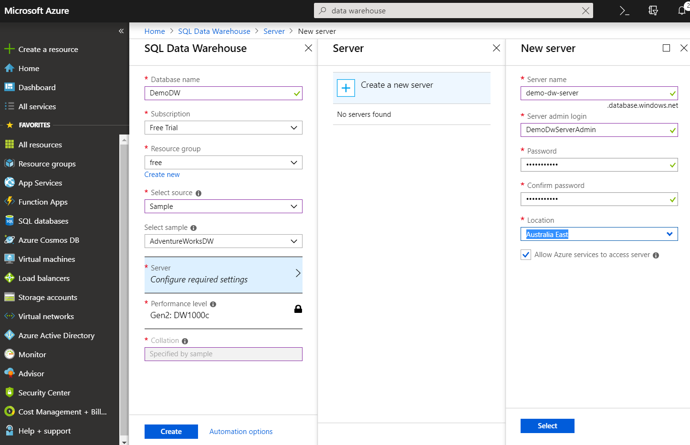

## Set firewall access rules by using the portal

Azure Synapse Analytics provides controls to restrict access to the data warehouse infrastructure via firewall rules. Firewall rules are the first level of defense against unauthorized access to the data warehouse assets. Firewall rules specify which IPs or IP ranges can access the data warehouse assets, and they reject any connections that come from IPs other than the allowed list or range. The firewall rules are enforced at the server level. 

To specify firewall rules:

1. Go to the Azure portal from your browser.
1. Select **SQL databases** in the left pane.
1. Select the data warehouse that you created in the previous section.
1. Select **Server name** in the right pane.

   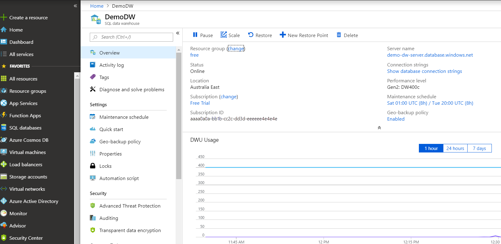

1. Select **Show firewall settings**.
1. Select a name for **RULE NAME**, **START IP**, and **END IP**.

   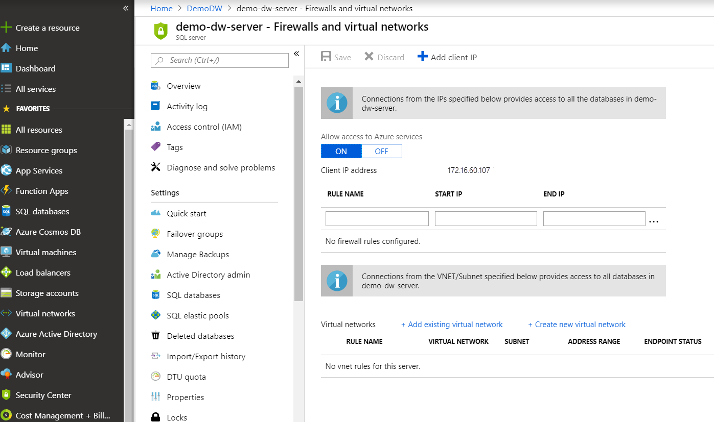

## Create an Azure Synapse Analytics data warehouse login by using SQL Server Management Studio

Azure Synapse Analytics supports two types of authentication to verify the identity of users who connect to it: SQL authentication and Microsoft Entra authentication.

With SQL authentication, users connect to the data warehouse by using a username/password combination. The Azure portal does not provide the ability to configure SQL authentication. To configure SQL authentication:

1. Open SQL Server Management Studio (which you installed as a prerequisite) and connect to the data warehouse. Get the server name from the Azure portal by going to the data warehouse, and use the username and password that you specified when you created the data warehouse.

   

1. Select **Connect**, which logs you in to the data warehouse.
1. Right-click **Logins** under **Security** in the left pane, and select **New Login**.

   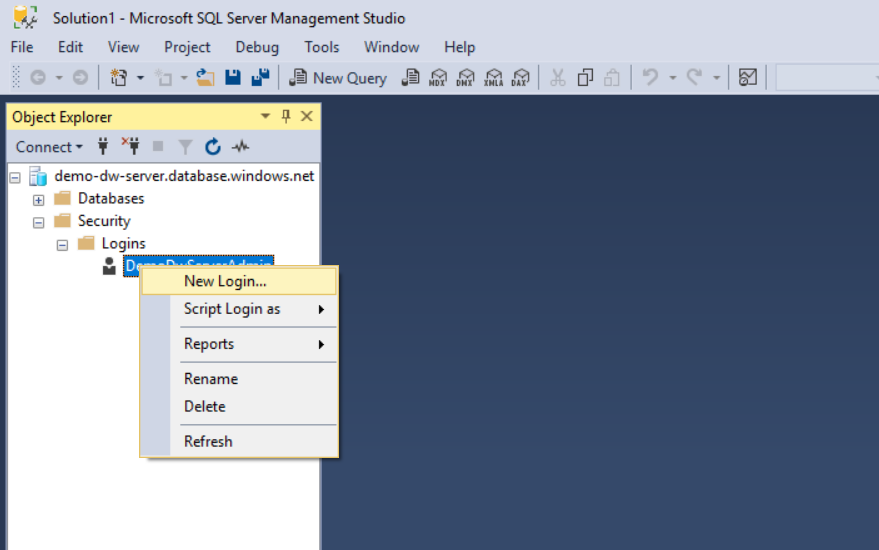

1. After the query pane appears with commands to create a login, change the username and password as desired and select **Execute**.

   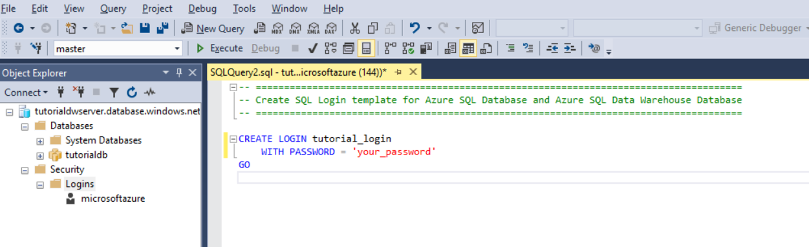

1. Right-click **Logins** under **Security** in the left pane, and select **Refresh**.
1. The newly created login appears under **Logins** in the left pane.

   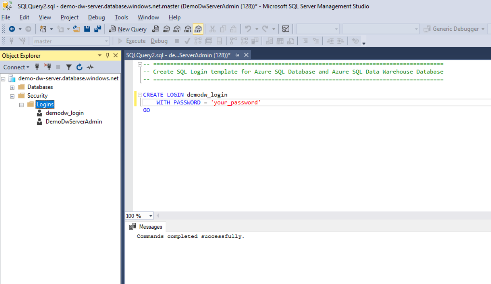

Microsoft Entra ID is a central location to manage identities for all Microsoft online and cloud services. Microsoft Entra authentication is beyond the scope of this lesson. It broadly involves four steps:

1. Create and populate a Microsoft Entra instance for your organization.
1. Associate the newly created Microsoft Entra instance with your Azure subscription.
1. Create a Microsoft Entra administrator for your data warehouse.
1. Map database users to Microsoft Entra identities.

## Create a new Azure Synapse Analytics data warehouse user by using SQL Server Management Studio

Creating a login provides access to the data warehouse server but not its databases or database objects. To provide access to logins for specific databases and objects, you need to create a user and assign a role. 

Roles allow various levels of user access to a database. This approach to security is called role-based security. You can either use the several built-in roles or create custom roles to control users' access to the databases in the data warehouse. In this example, we'll assign the built-in `db_datareader` role to the user that we create.

1. Open SQL Server Management Studio and connect to the data warehouse. Get the server name from the Azure portal by going to the data warehouse, and use the username and password that you specified when you created the data warehouse.

   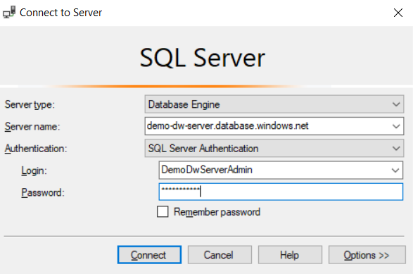

1. Select **Connect**, which logs you in to the SQL data warehouse.
1. Expand **Databases** in the left pane, and expand **DemoDW** (which you created in the prerequisites).
1. Expand **Security**, and expand **Users**.
1. Right-click **Users**, and select **New User**.

   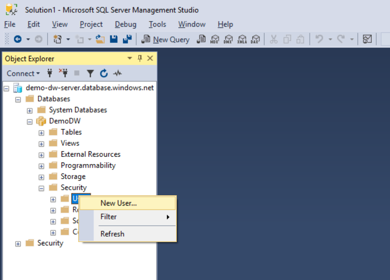

1. After the query pane appears with commands to create a user:
   
   a. Change the username parameter to a unique username.
   
   b. Change the login that you created in the previous section as the login parameter to the second command in the query pane.
   
   c Enter `db_datareader` as the first parameter, and enter the database user that you selected in the first step as the second parameter.
    
   d. Select **Execute**.

1. Right-click **Users** under **Security** in the left pane, and select **Refresh**.

   The newly created user appears under **Users** in the left pane.

   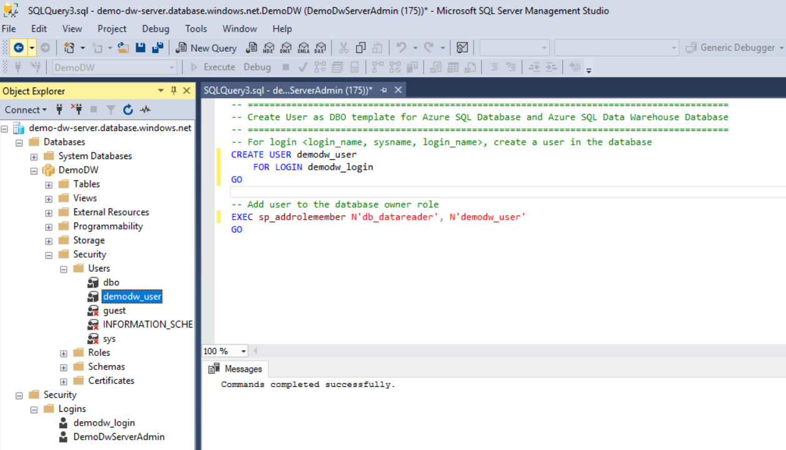

## Enable data encryption on a data warehouse by using the portal

### Encrypt data at rest

Data encryption at rest helps protect data in your data warehouse and satisfies a critical compliance requirement. Azure Synapse Analytics provides transparent data-at-rest encryption capabilities without affecting the client applications that connect to it. To turn on transparent data-at-rest encryption, use the following steps:

1. Go to the database that you created in the Azure portal.
1. Under **Security** in the options pane, select **Transparent data encryption**.
1. Select **ON**.
1. Select **Save**.

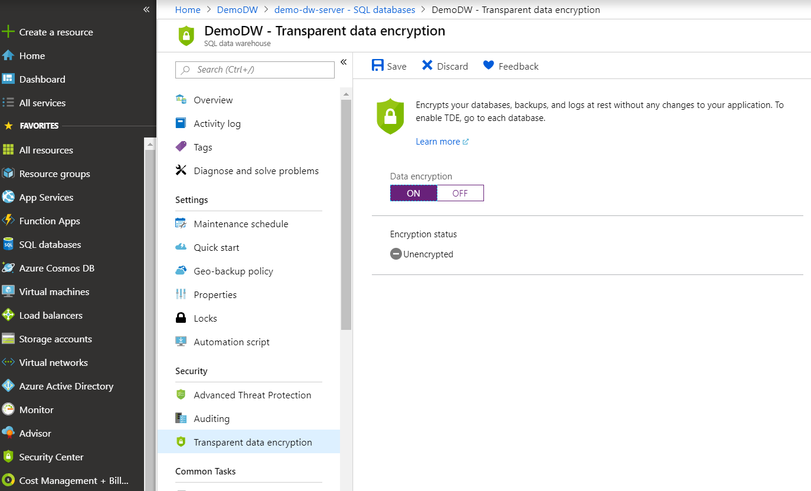

### Encrypt data in transit in your application

Data in transit is a method to prevent man-in-the-middle attacks. To encrypt data in transit, specify `encrypt=true` in the connection string in your client applications as follows. This ensures that all data sent between your client application and SQL data warehouse is encrypted with SSL.

```sql
String connectionURL =   
    "jdbc:sqlserver://<your_azure_sql_datawarehouse_fqdn>:1433;" +  
     "databaseName=DemoDW;username=your_username;password=your_password " +  
     "encrypt=true ";
```

## Restrict data access with granular security controls by using SQL Server Management Studio

In specific scenarios, granular security controls are essential for privacy and compliance. For instance, in a data warehouse that hosts data for all employees in a company, you would want to restrict access to individual columns or rows in tables to specific groups of management, depending on their role and function. Azure Synapse Analytics provides fine-grained security controls via column-level security and row-level security. In this section, we'll walk through how to enforce these controls on your data stored in Azure Synapse Analytics.

### Grant read access to data by using column-level security

Use the following steps to grant access to specific users to only certain columns of a table:

1. Open SQL Server Management Studio and connect to the data warehouse. Get the server name from the Azure portal by going to the data warehouse, and use the username and password that you specified when you created the data warehouse.

   

1. Select **Connect**, which logs you in to the SQL data warehouse.
1. Go to the **DemoDW** database and expand the **Tables** node. You see the **dbo.DimEmployee** table, which is the table where we'll limit access to the user that we previously created, **demodw_user**.

   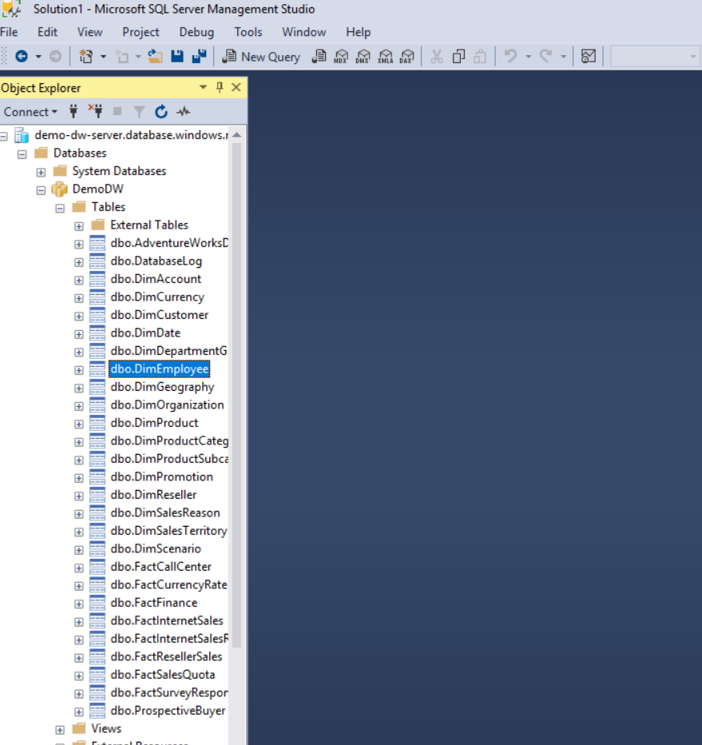

1. From the **File** menu, select **New** > **Query with Current Connection**.

   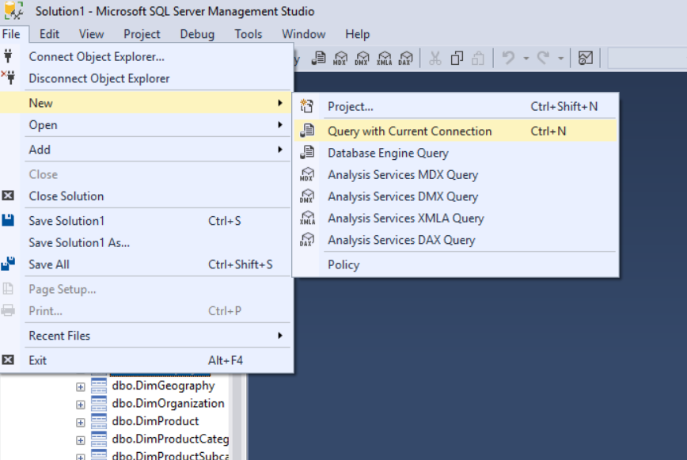

1. In the query pane, type the following command and select the **Execute** button.

   ```sql
   GRANT SELECT ON dbo.DimEmployee (FirstName, MiddleName, LastName, Title) TO demodw_user;
   ```

   

The user **demodw_user** can now access only the four columns in the table for which it was granted access. No other columns are visible to that user.

### Restrict access to data by using row-level security

Azure Synapse Analytics provides predicate-based row-level security. The rows in a table that don't satisfy the predicates are silently excluded from queries. Enforcing row-level security in Azure Synapse Analytics is a two-step process:

1. Creation of a table-valued function to define the access criteria
2. Creation of a security policy that adds filter predicates created in the previous step to any tables for which row-level access needs to be restricted

Follow these steps to enforce row-level security for the **dbo.DimEmployee** table in the **DemoDW** database:

1. Open SQL Server Management Studio and connect to the data warehouse. Get the server name from the Azure portal by going to the data warehouse, and use the username and password that you specified when you created the data warehouse.

   

1. Select **Connect**, which logs you in to the SQL data warehouse.
1. Go to the **DemoDW** database and expand the **Tables** node. You see the **dbo.DimEmployee** table, which is the table where we'll limit access to the user that we previously created, **demodw_user**.

   

1. From the **File** menu, select **New** > **Query with Current Connection**.

   

1. In the query pane, type the following command and select the **Execute** button.

    ```sql
    CREATE SCHEMA Security
    GO 
    
    CREATE FUNCTION Security.fn_rowlevel_predicate(@EmployeeLoginId AS sysname)  
        RETURNS TABLE  
    WITH SCHEMABINDING  
    AS  
        RETURN SELECT 1 AS fn_rowlevel_predicate_result
    WHERE @EmployeeLoginId = 'demodw_user'
    GO

    CREATE SECURITY POLICY EmployeeFilter
    ADD FILTER PREDICATE Security.fn_rowlevel_predicate(LoginId)
    ON dbo.DimEmployee
    WITH (STATE = ON)
    GO
    ```

Now, only **demodw_user** can access the rows in the **DimEmployee** table.


