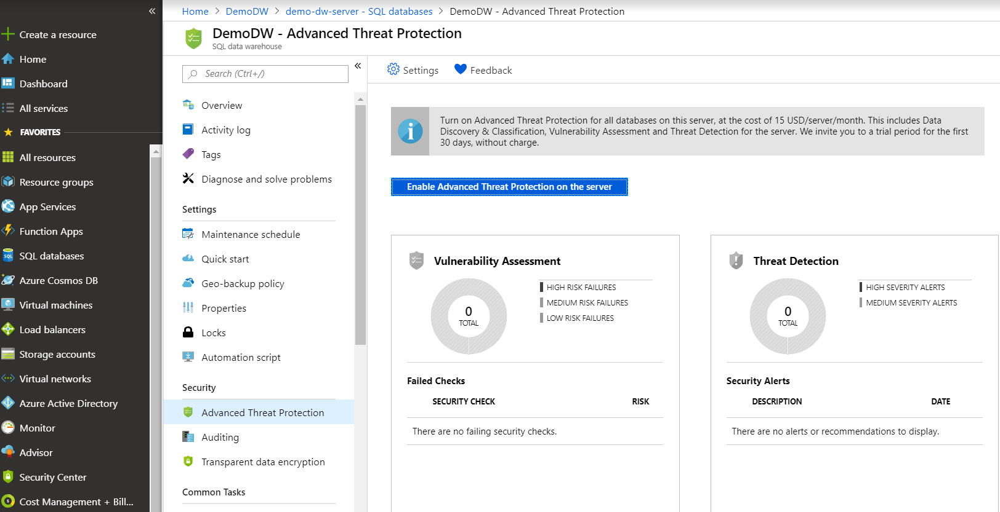
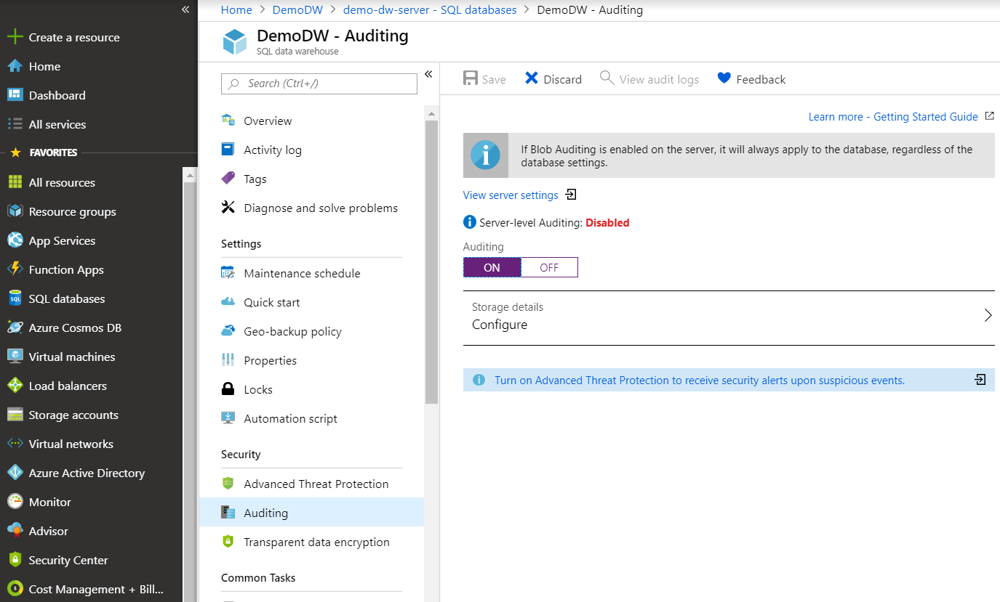
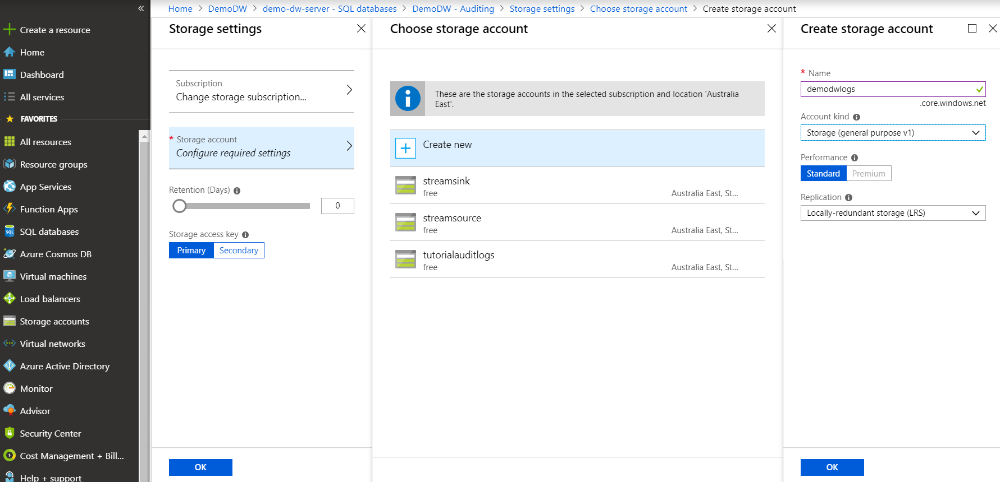

Azure SQL Data Warehouse provides built-in threat monitoring capabilities. It's off by default, but you can turn it on as follows:

1. Go to the database that you created in the Azure portal.
1. Under **Security** in the options pane, select **Advanced Threat Protection**.
1. Select **Enable Advanced Threat Protection on the server**.

You can set up a storage account to persist assessment logs for later vulnerability analysis.

## Turn on database auditing in the portal

Auditing tracks all database activity and helps maintain and satisfy compliance requirements. You can define audit trails for a data warehouse or a specific database. A server-wide policy applies to all databases that it hosts and all newly created databases within it. Audit logs can be written to an Azure storage account for further analysis. 

To turn on database-level auditing:

1. Go to the database that you created in the Azure portal.
1. Under **Security** in the options pane, select **Auditing**.
1. Select **ON**.

   

1. Select **Storage details** and fill in the details for the destination storage account for audit logs.

   

1. Select **OK**.
1. Select **OK** again after the storage account is provisioned.
