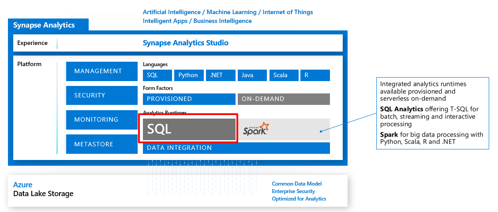

Azure Synapse Analytics can work by acting as the one-stop shop to meet all of your analytical needs in an integrated environment if you do not have an analytical environment in place already.
It does this by providing the following capabilities.

## Analytics capabilities using Azure Synapse SQL through either dedicated SQL pools or SQL Serverless pools

Azure Synapse SQL is a distributed query system that enables you to implement data warehousing and data virtualization scenarios using standard T-SQL experiences familiar to data engineers.

Synapse SQL offers both serverless and dedicated resource models to work with both descriptive and diagnostic analytical scenarios. For predictable performance and cost, you can create dedicated SQL pools to reserve processing power for data stored in SQL tables. For unplanned or ad hoc workloads, you can use the always-available, serverless SQL endpoint.
 

## Apache Spark pool with full support for Scala, Python, SparkSQL, and C#

You can develop big data engineering and machine learning solutions using Apache Spark for Azure Synapse. You can take advantage of the big data computation engine to deal with complex compute transformations that would take too long in a data warehouse.

For machine learning workloads, you can use SparkML algorithms and AzureML integration for Apache Spark 2.4 with built-in support for Linux Foundation Delta Lake.

There is a simple model for provisioning and scaling the Spark clusters to meet your compute needs, regardless of the operations that you are performing on the data.

## Integrate your data with Azure Synapse pipelines

Azure Synapse pipelines leverages the capabilities of Azure Data Factory. It's the cloud-based ETL and data integration service that enables you to create data-driven workflows for orchestrating data movement, and transforming data at scale. Using Azure Synapse pipelines, you can create and schedule data-driven workflows (called pipelines) that can ingest data from disparate data stores. You can build complex ETL processes that transform data visually with data flows, or by using compute services such as Azure HDInsight Hadoop, or Azure Databricks.

## Use Azure Synapse Link to perform operational analytics with near real-time hybrid transactional and analytical processing

Azure Synapse Analytics enables you to reach out to operational data using Azure Synapse Link, and is achieved without impacting the performance of the transactional data store. For this to happen, you have to enable the feature within both Azure Synapse Analytics, and within the data store to which Azure Synapse Analytics will connect, such as Azure Cosmos DB.

In the case of Azure Cosmos DB, this will create an analytical data store. As data changes in the transactional system, the changed data is fed to the analytical store in a Column store format from which Azure Synapse Link can query with no disruption to the source system.

## A single Web UI to access all Azure Synapse Analytics capabilities

While the Azure portal will enable you to manage some aspects of the product, Azure Synapse Studio is the best place to centrally work with all the capabilities.

Azure Synapse Studio is a single web UI that enables you to:

* Explore your data estate.
* Develop TSQL scripts and notebooks to interact with the analytical engines.
* Build data integration pipelines for managing data movement.
* Monitor the workloads within the service.
* Manage the components of the service.

## Integrate with a variety of Azure Data Platform technologies

For organizations that have existing analytical solutions, Azure Synapse Analytics can integrate with a wide variety of technologies to complement them. For example, if you are already using Azure Data Factory to build data integration pipelines, these can be used to load data into Azure Synapse Analytics.

You can also integrate existing data preparation or data science projects that you may hold in Azure Databricks. Integration is also available with many of Azure security components to ensure that you meet security and compliance requirements within your organization.

Upon initially deploying Azure Synapse Analytics, a few resources deploy along with it, including the Azure Synapse Workspace and an Azure Data Lake Storage Gen2 (ADLS Gen2) account that acts as the primary storage for the workspace.

Within the Azure portal, there are links to configure your workspace, manage access through Access control (IAM), firewalls, managed identities, and private endpoint connections, as well as view metrics.

The portal also contains important information about your Synapse Analytics environment, such as:

* The **Primary ADLS Gen2 account URL (1)**, which identifies the primary data lake storage account.
* The **SQL endpoint** and **SQL on-demand endpoint (2)**, which are used to integrate with external tools, such as SQL Server Management Studio (SSMS), Azure Data Studio, and Power BI.
* The **Workspace web URL (3)**, a direct link to Synapse Studio for the workspace.
* Available resources, such as **SQL pools** and **Apache Spark pools (4)**.

This module will only focus on the dedicated SQL pool capabilities of Azure Synapse Analytics.
