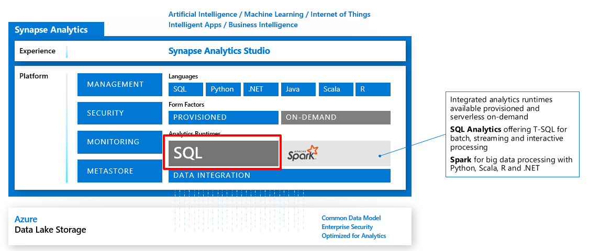

Azure SQL Data Warehouse is a cloud-based enterprise data warehouse (EDW) that uses massively parallel processing (MPP) to run complex queries across petabytes of data quickly. SQL Data Warehouse is the most appropriate solution when you need to keep historical data separate from source transaction systems for performance reasons. The source data might come from other storage mediums, such as network shares, Azure Storage blobs, or a data lake.

SQL Data Warehouse stores incoming data in relational tables that use columnar storage. The format significantly reduces data storage costs and improves query performance. After information is stored in SQL Data Warehouse, you can run analytics on a massive scale. Analysis queries in SQL Data Warehouse finish in a fraction of the time it takes to run them in a traditional database system.

SQL Data Warehouse is a key component in creating end-to-end relational big data solutions in the cloud. It allows data to be ingested from a variety of data sources, and it leverages a scale-out architecture to distribute computational processing of data across a large cluster of nodes. Organizations can use SQL Data Warehouse to:

- Independently size compute power, regardless of storage needs.
- Grow or shrink compute power without moving data.
- Pause compute capacity while leaving data intact, so they pay only for storage.
- Resume compute capacity during operational hours.

These advantages are possible because computation and storage are decoupled in the MPP architecture.
