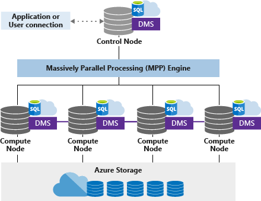

Azure Synapse Analytics separates the computation from the underlying storage which enables one to scale the computing power independently of the data storage. This is done by abstracting the CPU, memory, and IO, and bundling them into units of compute scale called SQL pool.

A SQL pool represents an abstract, normalized measure of compute resources and performance. By changing the service level, you alter the number of Data Warehouse Units (DWUs) that are allocated to the system, which in turn adjusts the performance, and thus the cost, of the system. To achieve higher performance, one can increase the number of DWUs, which also increases the associated costs. To achieve a lower cost and thereby less performance, you can reduce the DWUs. Storage and compute costs are billed separately, so changing the DWUs does not affect the storage costs.

Azure Synapse Analytics uses a node-based architecture. Applications connect and issue T-SQL commands to a control node, which is the single point of entry for the data warehouse. The control node runs the Massively Parallel Processing (MPP) engine which optimizes queries for parallel processing, and then passes operations to compute nodes to do their work in parallel. The compute nodes store all user data in Azure Storage and run the parallel queries. The Data Movement Service (DMS) is a system-level internal service that moves data across the nodes as necessary to run queries in parallel and return accurate results.

## Control node

The control node is the brain of the data warehouse. It is the front end that interacts with all applications and connections. The MPP engine runs on the Control node to optimize and coordinate parallel queries. When you submit a T-SQL query to the Azure Synapse Analytics, the control node transforms it into queries that run against each distribution in parallel.

## Compute nodes

The compute nodes provide the computational power. Distributions map to compute nodes for processing. As you pay for more compute resources, SQL Data Warehouse re-maps the distributions to the available compute nodes. The number of compute nodes ranges from 1 to 60 and is determined by the service level for the data warehouse.

## Data Movement Service

Data Movement Service (DMS) is the data transport technology that coordinates data movement between the compute nodes. When SQL Data Warehouse runs a query, the work is divided into 60 smaller queries that run in parallel. Each of the 60 smaller queries runs on one of the underlying data distributions. A distribution is the basic unit of storage and processing for parallel queries that run on distributed data. Some queries require data movement across nodes to ensure the parallel queries return accurate results. When data movement is required, DMS ensures the right data gets to the correct location.