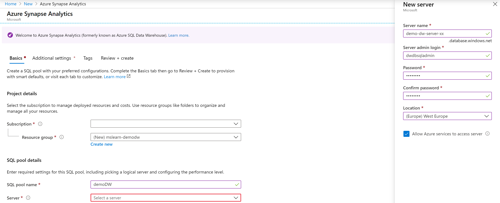

Now that we've covered the major design principles, let's see how easy it is to create a data warehouse in Azure. We'll use some sample data for exploration, but you can start building your own data warehouse by using the principles that are shown in this exercise.

> [!NOTE]
> This exercise is optional. If you don't have an Azure account or if you prefer not to do the exercise in your account, you can read through the instructions to understand the steps that are involved in creating a data warehouse in Azure SQL Data Warehouse.

Complete these steps to create a SQL data warehouse that contains the *AdventureWorksDW* sample data:

1. Sign in to the [Azure portal](https://portal.azure.com?azure-portal=true).
1. In the upper-left corner, select **Create a resource**.
1. Select **Databases** > **SQL Data Warehouse**.

    

1. On the new SQL data warehouse page, set the following values:
    - For **Database name**, enter **sampleDataWH**.
    - Select the **Subscription** you want to use.
    - Create a new **Resource group** named **mslearn-demodw**.

1. In the **Select source** list, select **Sample**.

1. In the **Select sample** list, select **AdventureWorksDW**.

1. Select **Server** to create and configure a new server for your new database. Fill in the **New server form** with the following information:
    - Use a unique name for the database name. We use **sampledatawh**. You must select a globally unique name.
    - Enter the admin credentials. We use **dwdbadmin** for the admin name.
    - Select a **Location** to physically host the server. Typically, this is a location that's close to the data consumer.

1. Select **Select** to set the server information and return to the Create blade.

    

1. Select **Create** to provision the database. Provisioning takes a few minutes.

You can monitor the deployment process through the notification ("bell") icon in the top bar - it will animate while the deployment is occuring. When the data warehouse is deployed, you have successfully created a data warehouse in Azure SQL Data Warehouse!
