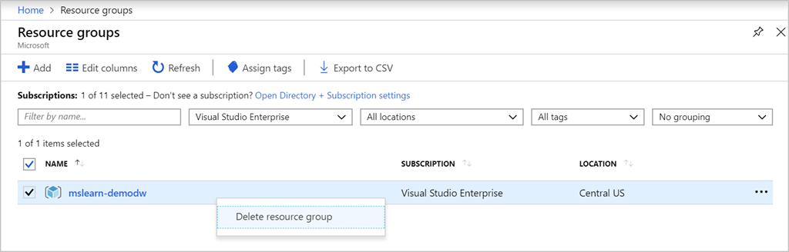

In this module, you learned that Azure SQL Data Warehouse is a cloud-based enterprise data warehouse (EDW) that uses massively parallel processing (MPP) to run complex queries across petabytes of data quickly. You learned how to optimize data storage by using round-robin, hash distribution, and replicated tables. Finally, you created a data warehouse.

## Cleanup

To avoid additional costs in your Azure account, delete the **mslearn-demodw** resource group. Deleting the resource group removes all the resources that you created in this module. 

To delete the resource group:

1. Find the **mslearn-demodw** resource group. To quickly locate the resource group, in the left menu, select **Resource groups**.

1. Select the resource group. Then, either right-click on the row or use the **...** button on the far-right side of the row to open the context menu.

1. Select **Delete resource group**.

    

1. Enter the name of the resource group, and then select **Delete**. Azure deprovisions all related resources for you.