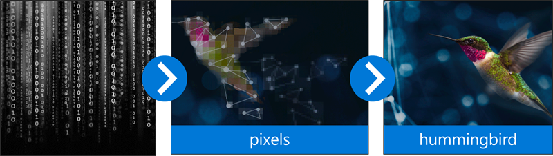

Imagine you run a packaging business that ships products all over the world. Your company has invested heavily in automation to pack boxes and optimize the size of each shipped box. But you've gotten some complaints about torn or damaged packaging. The product assurance team members are evaluating how to inspect packaged products before shipping. They want to automate the inspection process and only involve a person if the packaging is determined to be defective.

The Azure Custom Vision cognitive service combines artificial intelligence and machine learning to provide a sophisticated image classification and detection service.

<!-- should we try to create an image that matches our scenario? -->

You can use these capabilities directly through the Custom Vision service web portal to create and train a model, test it for accuracy, and then use it to evaluate and apply labels to images. But this process isn't sufficient for your use case.

Instead, your development team wants to use the REST-based APIs that allow custom applications and scripts to take advantage of the same Custom Vision service capabilities provided in the web portal. By using the Custom Vision APIs, your company can integrate this cognitive service directly into your existing automation process to quickly and accurately identify bad packages before they're shipped to customers.

In this module, you will:

- Evaluate the requirements for service authorization
- Examine the API for image prediction
- Examine the API for training predictive models

<!-- TODO: make sure our above objectives are matched in the YML -->