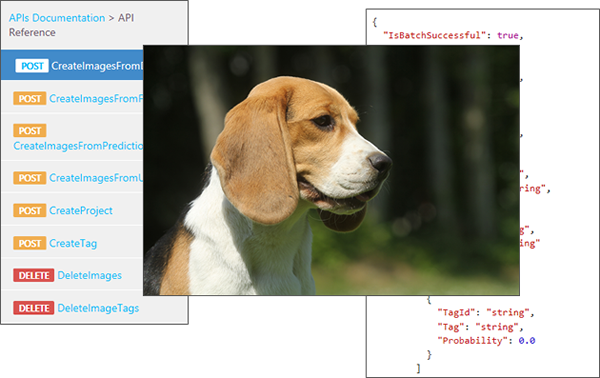

The Custom Vision APIs use built-in algorithms that provide the services with "intelligence." You can use these algorithms to create and customize your own state-of-the-art computer vision models with just a few lines of code.

The Custom Vision API algorithms are exposed as simple REST-based service calls. Developers can use the REST calls to create projects (classifiers), upload and tag images, perform training, manage model iterations, and even make predictions.



> [!TIP]
> This module focuses on the REST services that can be used by any language. Microsoft also publishes open-source SDKs for .NET, Python, Java, Node.js, and Go that wrap the underlying REST APIs into framework-specific objects and methods. Check out the documentation for more information on the available SDKs.

## Custom Vision APIs

The Custom Vision APIs are the perfect way to use the power of artificial intelligence to:

- Create state-of-the-art computer vision models.
- Upload and tag training images.
- Train classifiers for active learning.
- Perform image prediction to identify probable matches to a trained model.
- Perform object detection to locate elements *within* an image and return a bounding box.

In general, the methods provided by the Custom Vision APIs fall into these categories:

- **Training**. Manage projects (classifiers) and upload, tag, and manage training images.
- **Prediction**. Make predictions based on classification models.

As with the related Computer Vision API, to call the Custom Vision APIs, you simply make a secure web request. For example, here's a simplified version of what a call to a Custom Vision API might look like in Python:

```python
conn = httplib.HTTPSConnection('southcentralus.api.cognitive.microsoft.com')
conn.request("POST", serviceEndpointUrl, body)
response = conn.getresponse()

data = response.read()
```

The same API call in C# is similar:

```csharp
HttpClient client = new HttpClient();
StringContent content = new StringContent(body);
response = await client.PostAsync(serviceEndpointUrl, content);

string data = await response.Content.ReadAsStringAsync();
```
