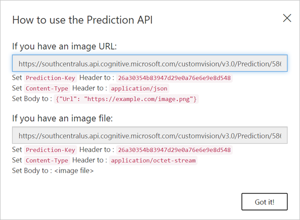

The most common task an application or script will do with the Custom Vision service is request image predictions through the Prediction API. This task involves sending an authorized web request to the subscription endpoint and processing the information returned from the call.

> [!TIP]
> For testing purposes, subscribers can practice using the Prediction API through the [Custom Vision Prediction API testing console](https://southcentralus.dev.cognitive.microsoft.com/docs/services/Custom_Vision_Prediction_3.0/operations/5c82db60bf6a2b11a8247c19 "Custom Vision Prediction API testing console"). Be sure to select the testing console that's associated with the region where the service is deployed.

### Calling the Prediction API

You access the Prediction API through a public web endpoint that's specific to your registered Custom Vision service. There are two APIs available, depending on the project type: image classification and object detection.

#### Image classification
Image classification analyzes a supplied image and returns a list of labels (tags) identified in the image. Several endpoints are supplied. Here are the two most commonly used endpoints:

- **ClassifyImage** accepts a binary payload (`"application/octet-stream"`) as a byte array that contains the image data.
- **ClassifyImageUrl** accepts a JSON payload (`"application/json"`) that specifies a publicly available image URL.

#### Object detection
Object detection is similar to image classification, but it also returns the coordinates (the bounding box) where the tag was located within the image. As with classification, two commonly used endpoints are available:

- **DetectImage** accepts a binary payload (`"application/octet-stream"`) as a byte array that contains the image data.
- **DetectImageUrl** accepts a JSON payload (`"application/json"`) that specifies a publicly available image URL.

These API endpoints both use the same structure to form the URL:

```text
https://{endpoint}/customvision/v3.0/Prediction/{projectId}/{projectType}/iterations/{iterationName}/{imageType}
```

In this URL:

- `{endpoint}` is the location endpoint the service was created in, for example, `southcentralus.api.cognitive.microsoft.com`.
- `{projectId}` is a unique project identifier that's used to specify the Custom Vision service.
- `{projectType}` is either `classify` for image classification or `detect` for object detection.
- `{iterationName}` is the name of the trained model iteration that's being used.
- `{imageType}` is either `url`, when the image is passed as a URL, or `image`, when the image is passed as binary data in the body of the request.

> [!IMPORTANT]
> The API you call, Detect versus Classify, is based on the *type* of project you create in the Custom Vision service. If you don't call the proper API, the service will return `400 Bad Request - Invalid project type for operation`.

### Locating the project URL

The specific endpoint details are available in the Custom Vision service portal. If you select the **View Endpoint** button on the **Predictions** tab or the **Prediction URL** option on the **Performance** tab, you'll see a dialog box similar to this one:



### Constructing the HTTP request

After you identify the proper URL, you invoke it by using an HTTP POST request. Remember that you need to pass a prediction key with the request. This key is provided as a request header with the name `Prediction-Key`.

For example, the following C# code sends an image URL to the Prediction API with the given endpoint and prediction key:

```csharp
public async Task<string> MakePredictionRequestAsync(string url, string predictionKey, string imageUrl)
{
    var client = new HttpClient();
    client.DefaultRequestHeaders.Add("Prediction-Key", predictionKey);
    using (var content = new StringContent("{\"Url\":\"" + imageUrl + "\"}", Encoding.UTF8, "application/json");)
    {
        var response = await client.PostAsync(url, content);
        return await response.Content.ReadAsStringAsync();
    }
}
```

In Python 3, the same code might look something like this example:

```python
import http.client, urllib.request, urllib.parse, urllib.error, base64

headers = {
    'Content-Type': 'application/json',
    'Prediction-Key': '{prediction key}',
}

body = "{'Url' : '" + url + "' }"

try:
    conn = http.client.HTTPSConnection('southcentralus.api.cognitive.microsoft.com')
    conn.request("POST", "/customvision/v3.0/Prediction/{projectId}/classify/iterations/{iterationName}/url", body, headers)
    response = conn.getresponse()
    data = response.read()
    print(data)
    conn.close()
except Exception as e:
    print("[Errno {0}] {1}".format(e.errno, e.strerror))
```

> [!NOTE]
> The Prediction API methods also accept an optional query string parameter named `application` to identify the app that's invoking the service. This value can be used to track the applications that are using the Custom Vision service.

### Passing image files directly

If you're using the *binary file payload* **ClassifyImage** or **DetectImage**, the request body should contain the image data encoded into a byte array. Here's the same call using the **ClassifyImage** endpoint instead. In this case, the `Content-Type` header must be set to `"application/octet-stream"`.

```csharp
public async Task<string> MakePredictionRequestAsync(string url, string predictionKey, string imageFile)
{
    var fileStream = new FileStream(imageFile, FileMode.Open, FileAccess.Read);
    var binaryReader = new BinaryReader(fileStream);
    var bytes = binaryReader.ReadBytes((int)fileStream.Length);

    var client = new HttpClient();
    client.DefaultRequestHeaders.Add("Prediction-Key", predictionKey);
    using (var content = new ByteArrayContent(bytes))
    {
        content.Headers.ContentType = new MediaTypeHeaderValue("application/octet-stream");
        var response = await client.PostAsync(url, content);
        return await response.Content.ReadAsStringAsync();
    }
}
```

### Processing the response

The Prediction API returns a JSON object that includes several bits of information. The most important information here is an array of *predictions* that indicates the probability that the supplied image contained that trained element. For example, if the model were trained to recognize types of animals found in the Arctic Circle and we provided a picture of a polar bear, **ClassifyImage** might return an object like this one:

```json
{
   "id":"71b145f7-8533-4cf4-9821-f31a4293508a",
   "project":"586008f5-2d8e-4e4a-abb4-66127e96a4f4",
   "iteration":"f118e60f-5e25-40ad-89a2-3b6b1cdd5dac",
   "created":"2019-06-19T20:55:10.240Z",
   "predictions":[
      {
         "probability":1.0,
         "tagId":"8b2ada4d-1d0f-4b07-af19-dfd643043e1f",
         "tagName":"Polar bear"
      },
      {
         "probability":3.3948698E-11,
         "tagId":"56fe8dca-2849-454a-8aa0-5897b1c30009",
         "tagName":"Arctic fox"
      },
      {
         "probability":1.96249064E-13,
         "tagId":"ae6f7ccb-46ac-44af-9b70-8d91f4951122",
         "tagName":"walrus"
      }
   ]
}
```

Each prediction contains a `tagId` that identifies the matched tag, a `tag` that provides a friendly name for the tag, and a `probability` value from 0 through 1 that indicates how confident the service was in identifying the given tag in the image.
