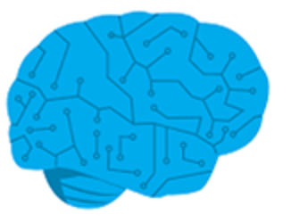

Deep Learning Virtual Machines (DLVMs) use GPU-based hardware that provide increased mathematical calculation speed for faster model training. Windows and Ubuntu operating systems support this variation of Azure DSVM. To understand why you would choose a DLVM, we need to understand the difference between machine learning and deep learning. Then we will look at what the Deep Learning Virtual Machine offers.

## Understand differences between Deep Learning and Machine Learning

Deep learning and machine learning are two terms that are frequently used in the world of data science. So, let's define them to get a better understanding of when Deep learning virtual machines are useful.

*Deep learning* is encompassed in machine learning because it also uses algorithms in the same way. However, instead of needing intervention, the algorithm decides what to do with the results and whether they're accurate. To make the final decision, deep learning uses a method called *artificial neural networks*, which is a process that simulates the decision process of the human brain's neural network.

*Machine learning* is the process of using algorithms to learn from data and make decisions based on that data. After the algorithm has made a prediction, a data scientist looks at the predictions and determines their accuracy and how to move forward with the results.

## Simplify tasks with DLVMs

Creating a neural network can be difficult because there are many tools that a data scientist could use to complete that task. This can be intimidating. The DLVM simplifies that process by including preconfigured tools for different situations.

## Key features

Key features of DLVMs include:

- All tools that are included in a Linux-based DSVM
- Deep-learning tools
- GPU-based VMs
- Catalog of tools and samples
- Samples of different deep-learning scenarios

Although deep learning falls under the umbrella of machine learning, deep learning requires a specific set of tools to build advanced neural networks. The DLVM is a powerful tool that aids in the deep learning process by providing preinstalled and preconfigured necessary technology.
