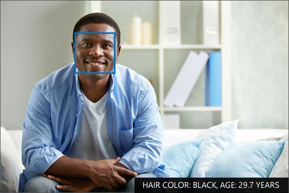

Faces are everywhere. Earth is filled with over 7,500,000,000 faces - every one of them unique and distinct from the others. Although faces change over time with age and other conditions, the ability to detect, identify, and recognize faces is one of the most incredible aspects of the human brain.

By leveraging the power of Azure Cognitive Services artificial intelligence algorithms, processes that were difficult, or even impossible, are now a few lines of code away, using the Microsoft Cognitive Vision Services Face API.

> [!NOTE]
> This module requires an Azure subscription. The services you create and use are free, but an active subscription or trial will be needed to complete the exercises. If you don't have an Azure subscription, [create a free account](https://azure.microsoft.com/free/) before you begin.

## Learning objectives

In this module you will:

- Learn what the Face API is
- Gain an understanding of concepts related to the Face API
- Explore the Emotion API