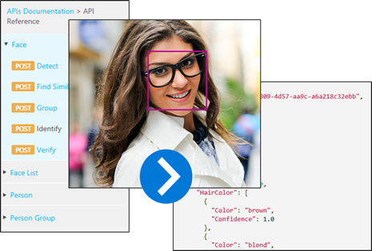

The Face API provides algorithms, exposed as REST-based web service calls, to detect, verify, identify, and analyze faces. The service can provide face matching, face attributes, characteristic analysis, and organize people and list of facial definitions into groups to locate similar faces.

The Face API methods fall into five categories.

1. **Verification** - Check the likelihood that two faces belong to the same person.
2. **Detection** - Detect human faces in an image.
3. **Identification** - Search and identify faces.
4. **Similarity** - Easily find similar-looking faces.
5. **Grouping** - Organize unidentified faces together into groups, based on their visual similarity.

The Face API is a perfect way to leverage the power of artificial intelligence to:

:::row:::
  :::column:::
- Detect human activity in images
- Attempt face matching against existing image databases
- Detect human faces and return their coordinates
  :::column-end:::
  :::column:::
- Manage profiles based on face attributes
- Analyze and identify faces in video frames
- and more...
  :::column-end:::
:::row-end:::

## Authorization

The Azure Cognitive Services Face API requires special authorization via the concept of a **Subscription Key**. Every programmatic call to the Face API requires a subscription key to be passed to the service either via a value in the query string parameter or specified in the request header.

Authorizing an API call to the Face service is just a matter of providing a Subscription Key, and the code you write would only depend, again, on your language of choice.

With a quick list of what the Face API provides, as well as some examples of using the Face API from various programming languages, you're ready to subscribe to the Face API and have subscription keys generated.