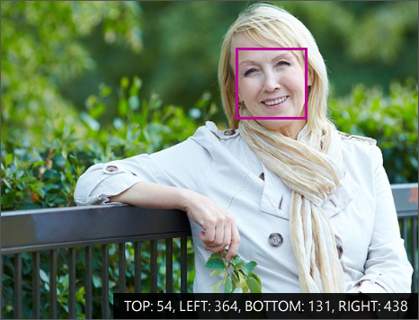

The Face API provides methods to detect human faces in images and can return face locations, landmarks, and attributes:

- **Locations**: In the image that includes a face, the Face API finds the top, left, width, and height coordinates of the face region.
- **Landmarks**: The Face API finds the position of common face elements, such as pupils, nose, and lips.
- **Attributes**: The Face API estimates face attributes such as age, gender, hair color, smile, facial hair, glasses, and emotion.

## Locations

A *face location* is another term for a collection of _face coordinates_. The location is a rectangular pixel area in the image where a face has been identified.

## Landmarks

*Face landmarks* are a collection of detailed points on a face. These points identify common facial elements such as a pupil, nose, or eyebrow by using pixel coordinates. The Face API can return up to 27 landmarks for each identified face that you can use for analysis.

:::image type="content" source="../media/3-face-recognition-landmarks.png" alt-text="A chart of Face API landmarks":::

## Attributes

*Face attributes* are predefined properties of a face or a person represented by a face. The Face API can optionally identify and return the following types of attributes for a detected face:

- Age
- Gender
- Smile intensity
- Facial hair
- Head pose (3D)
- Emotion
