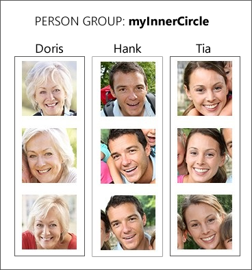
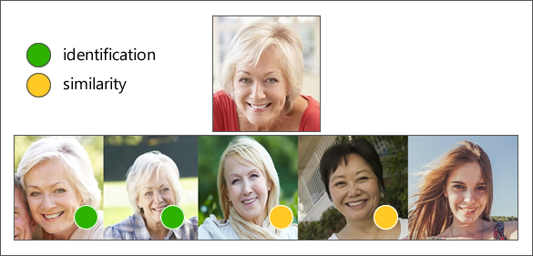

Strictly speaking, a _face list_ is a group of faces. Creating and managing a face list is useful when you want to find similar faces in a "fixed" collection of faces, for example, to find a similar face in a set of pictures of celebrities, friends, or family members.

Working with face lists involves working with several pieces of information including:

- A **face**: A single face
- The **face list**: A list or collection of faces
- A **person**: A single person
- The **person group**: A list or collection of people (persons)

The relationship between these terms can get a little fuzzy, so it's helpful to take a look at these relationships visually.

Face lists are a great fit when working with face **identification** and face **similarity**.

## Face identification

The Face API can be used to identify people based on comparing a detected face against a person group. Remember, a person group is like a "database of people." For example, you might create a person group named "myInnerCircle".  

Identification can be performed against the person group using a different face. If the face is identified as a person in the group, the person object will be returned as a match.

## Face similarity

Face lists are also a great way to determine _face similarity_. For example, you could compare a target face against a face list, and the Face API returns a small collection of faces that _looks similar_ to the target face. The Face API supports two working modes: **match face** and **match person**.

- **match person**: returns similar faces after applying a *same-person threshold* derived from face verification.
- **match face**: returns similar faces by ignoring the same-person threshold.

For example, look at this image.

Face similarity would determine the **first and second faces** to be the same person, and the **third and fourth faces** to be similar.

## Collection capacity

Although it's not likely you'll hit a collection threshold, it's helpful to know what the capacity for Face API storage collections are:

- **Face List**: Up to 1,000 distinct faces
- **Person Group**: Up to 10,000 persons
- **Person**: Up to 248 faces

That's a lot to digest, however working with the Face API is a breeze once these concepts sink in.
