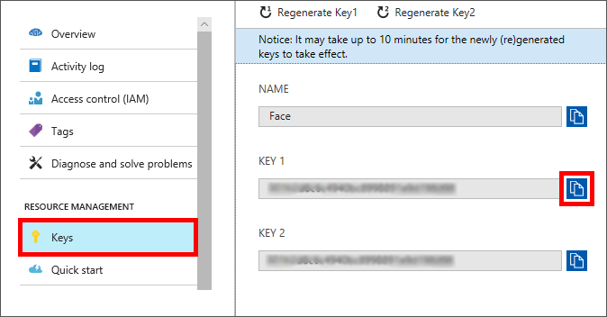
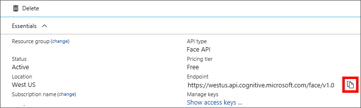

In this exercise, you'll create a Face API subscription and access its key and endpoint.

## Create a Face API subscription

To subscribe to the Face API:

1. Sign in to the [Azure portal](https://portal.azure.com?azure-portal=true).

1. Select **+ Create a resource** > **AI + Machine Learning** > **Face** > **Create**.

1. Enter a unique name for your Face API subscription, and then choose the **Location** nearest to you.

1. Select the free or lowest-cost **Pricing tier**.

1. Create a new Resource group named **mslearn-faceapi**. You'll later delete these resources.

1. Select **Create** to subscribe to the Face API.

After a short delay, your new Face API subscription will be provisioned and available, and new API keys will be generated for programmatic use.

> [!NOTE]
> Cognitive Services documentation often uses the terms *subscription key* and *API key* synonymously.

To view your new Face subscription, on the left sidebar, select **Resource groups**. Then select the resource group you created for the Face API.

## Access the subscription key and endpoint

After you create a Face API subscription, you're almost ready to start experimenting with the Face API.

Because all Computer Vision APIs are REST-based, you can use your language of choice to provide a subscription key (or API key) to the Computer Vision API endpoint (or URL).

To view the subscription key and endpoint for your Computer Vision subscription:

1.  On the left sidebar, select **Resource groups**, and then select the resource group you created for the Computer Vision API.

1.  To view your new subscription keys, select the Face API subscription name (such as **Face**). Then under **Resource Management**, select **Keys**.

1. Copy the value of **KEY 1**.

    

1. In the menu group, select **Overview**. Then copy the value under **Endpoint**.

    

Now that you know the location and values of your Face API subscription key and endpoint, you're ready to start writing some code or testing the API with an image.