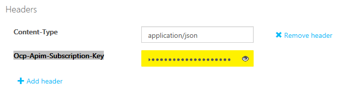
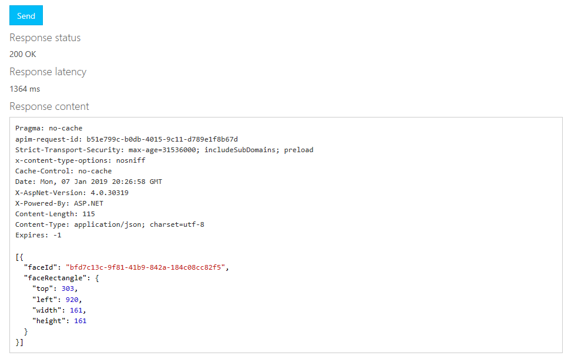

Now let's use the Face API subscription you just created to detect faces in images from a website.

We're going to use the Cognitive Services _testing console_. The testing console is a built-in website you can use to build and send REST requests for any of the AI services.

1. Open your Face API subscription.
1. Copy one of the subscription keys by using the **Copy** button to the right of the key value.

1. Open the [Face API service page](https://westus.dev.cognitive.microsoft.com/docs/services/563879b61984550e40cbbe8d/?azure-portal=true).

1. In the **Face Detect** section, select the **Open API testing console** button that's associated with the location where you created your Azure service. For example, if you used _WestUS_, in the testing console section, select **West US**. In the testing page that opens, you can enter the parameters you want to send to the service, submit the request, and then see the response right in the browser.

1. Scroll down to the **Headers** section and paste your subscription key in the **Ocp-Apim-Subscription-Key** text box.

    

1. Locate an image that includes a face. You can use your own image URL, or use this one:

    

1. In the **Request body** section of the tester, paste the URL as a JSON block. Here we're using the image URL from the previous step. If you want to use your own image, replace the `url` value that's shown here:

    ```json
    {
        "url": "https://docs.microsoft.com/learn/data-ai-cert/identify-faces-with-computer-vision/media/clo19_ubisoft_azure_068.png"
    }
    
    ```
1. Select **Send**.

The HTTP response should look something like this:

