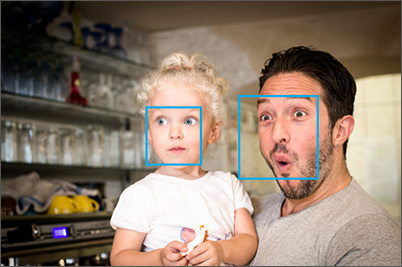

While working with your Face API service, you might have noticed it can return general emotion values through the **Detect method emotion** attribute. It's also likely you noticed the returned information was a bit sparse, and typically only registered a level of happiness. The Azure Cognitive Services Emotion API builds on this feature, by providing additional methods and algorithms for detecting a rich set of emotion in images displaying human faces.

The Emotion API provides advanced face analysis algorithms to evaluate a confidence level for the following set of emotions: **anger**, **contempt**, **disgust**, **fear**, **happiness**, **neutral** (the absence of emotion), **sadness**, and **surprise**.

## Scores and Locations

When using the Emotion API, detected faces are associated with face **locations**, as with the Face API, however a collection of values is added to the payload describing the likelihood of various emotions—based on a variation of confidence levels, referred to as **scores**.

- **Score**: The likelihood or level of "confidence" a face is displaying a specific emotion
- **Location**: The top, left, height, and width of a region in the image displaying a face

Scores, just like confidence levels, are similar to percentages, using a range of 0.0 to 1.0. The higher the value, the more certain the service is of the accuracy of an emotion.
