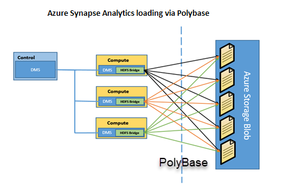

The data warehouse component of Azure Synapse Analytics service is a relational big data store that uses a massively parallel processing (MPP) architecture. It takes advantage of the on-demand elastic scale of Azure compute and storage resources to load and process petabytes of data. With Azure Synapse Analytics, you get quicker access to the critical information you need to make good business decisions.

A key feature of Azure Synapse Analytics is that you pay for only the processing you need. You can decide how much parallelism is needed for your work. You also can pause the compute nodes when it's not in use. In this way, you pay for only the CPU time you use.

Azure Synapse Analytics supports many loading methods. These methods include non-PolyBase options such as Bulk Copy Utility (BCP) and the SQL Bulk Copy API. The fastest and most scalable way to load data is through PolyBase. PolyBase is a technology that accesses external data stored in Azure Blob storage, Hadoop, or Azure Data Lake Store via the Transact-SQL language.

> [!VIDEO https://channel9.msdn.com/Shows/Learn-Azure/Introduction-to-Polybase/player?format=ny]

The following architecture diagram shows how loading is achieved with each Hadoop Distributed File System (HDFS) bridge of the data movement service (DMS) on every compute node that connects to an external resource such as Azure Blob storage. PolyBase then bidirectionally transfers data between Azure Synapse Analytics and the external resource to provide the fast load performance.

## Use PolyBase to extract, load, and transform data

Follow these steps to implement a PolyBase extract, load, and transform process for Azure Synapse Analytics:

1. Extract the source data into text files.

1. Load the data into Azure Blob storage, Hadoop, or Azure Data Lake Store.

1. Import the data into Azure Synapse Analytics staging tables by using PolyBase.

1. Transform the data (optional).

1. Insert the data into production tables.

Let's look more closely at the import process defined by steps 1-3.
