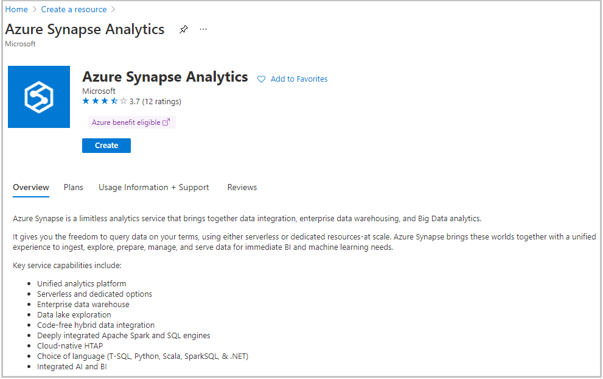

First, let's create a Data Lake Storage named **demodw** in Azure Synapse Analytics.

> [!NOTE]
> This exercise is optional. If you don't have an Azure account, or prefer not to do the exercise in your account, read the instructions to understand how to create a blank data warehouse.

To create an Azure Synapse Analytics workspace, perform the following steps:

1. Sign in to the [Azure portal](https://portal.azure.com) with your Azure account.

1. Select **Create a resource.** The **Create a resource** pane appears.

1. In the search box, search for and select *Azure Synapse Analytics*. The **Azure Synapse Analytics** pane appears.

1. Select **Create.**

    > [!div class="mx-imgBorder"]
    > 

    The **Create Synapse workspace** pane appears.

1. On the **Basics** tab, enter your preferred subscription, resource group, region, and then enter a workspace name.
 
    > [!div class="mx-imgBorder"]
    > 

1. You must select a Data Lake Storage Gen2 account and a container in that account to create a workspace. The simplest choice it to create a new one. Under both **Account name** and **File system name**, select either the **Create new** links, or use existing names by selecting ones from the dropdown list.

1. Select **Review + create > Create.** Your workspace is ready in a few minutes.
