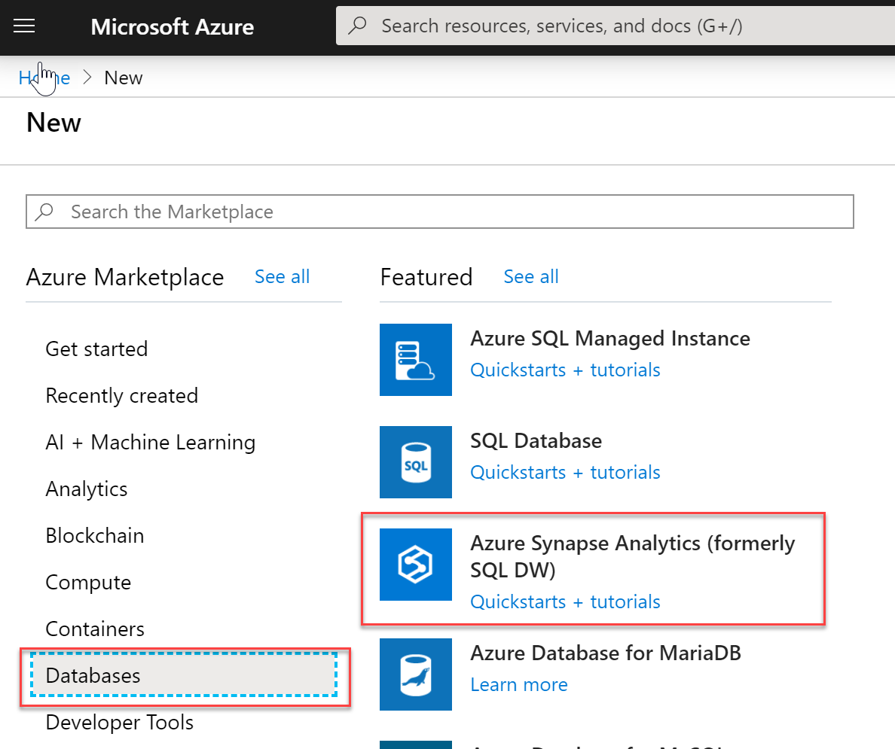
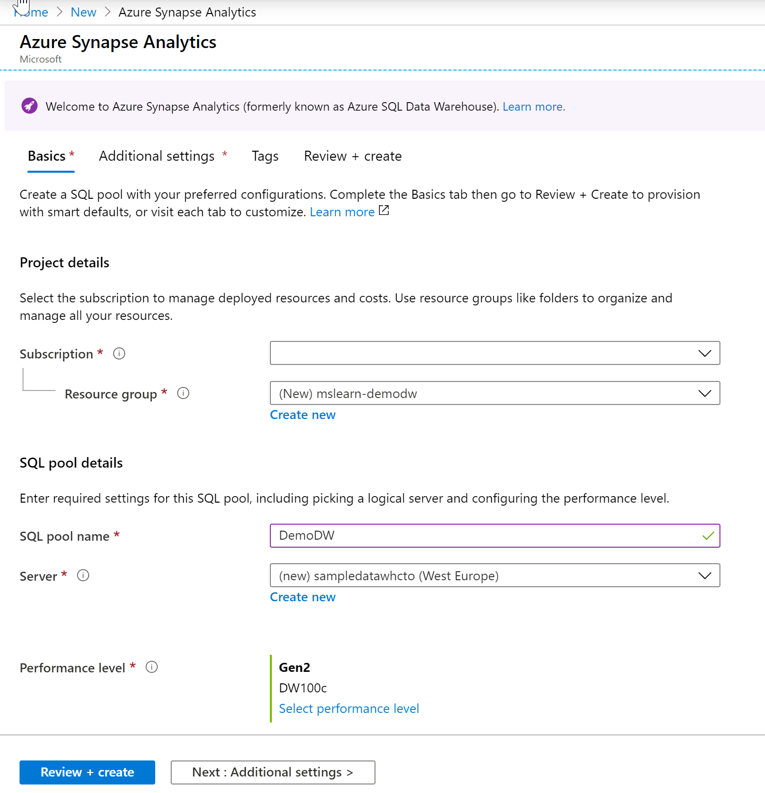

First, let's create a blank database named **DemoDW** in Azure SQL Data Warehouse.

> [!NOTE]
> This exercise is optional. If you don't have an Azure account, or prefer not to do the exercise in your account, read the instructions to understand how to create a blank data warehouse.

1. Sign in to the [Azure portal](https://portal.azure.com?azure-portal=true).
1. Select **Create a resource** in the upper-left corner of the Azure portal.
1. Select **Databases** > **SQL Data Warehouse**.

    

1. On the new SQL Data Warehouse page, use the following values for the boxes:
    - Set the **Database name** to "DemoDW".
    - Select the **Subscription** you want to use.
    - Create a new **Resource group** named **mslearn-demodw**.
    - Select **Blank database** for the **Source** to create an empty database.

1. Select **Server** to create and configure a new server for your new database. Fill out the **New server form** with the following information:
    - Use a unique name for the database name. For example, use **sampledatawh** with a random number suffix or your initials.
    - Fill in the admin credentials. For example, use **dwdbadmin** for the admin name.
    - Select a **Location** to physically host the server. Typically, the location is close to the data consumer.
    
1. Click **Select** to set the server information and go back to the **Create** blade.
1. Select **Performance level** > **Gen2**, and move the slider position to its lowest value, **Gen 2: DW100c**.
1. Select **Apply** to set the performance level. Your settings look something like the following image.

    

1. Select **Create** to provision the database. Provisioning takes a few minutes.

Monitor the deployment process through the notifications icon. You successfully created a data warehouse after it deploys.
