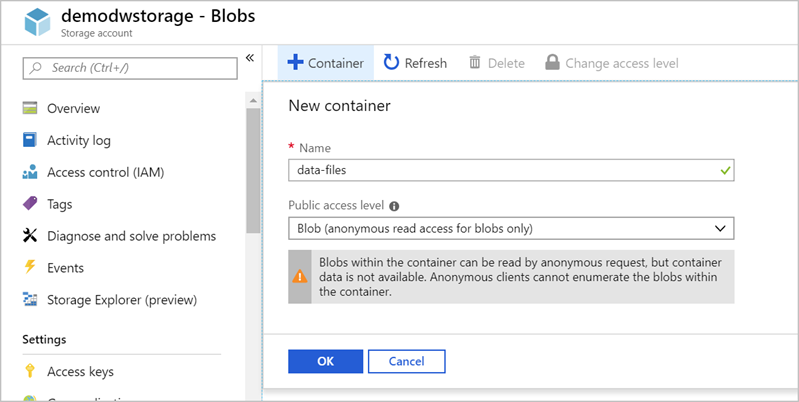

Next, let's create an Azure Storage account and Blob storage container to hold the data we want to import into our data warehouse.

> [!NOTE]
> This exercise is optional. If you don't have an Azure account, or prefer not to do the exercise in your account, you can read through the instructions to understand the steps involved in creating the Blob storage container and associated storage account.

## Create the Azure Storage account

1. Sign in to the [Azure portal](https://portal.azure.com) with your Azure account.
1. Select **Create a Resource** in the left sidebar.
1. Select **Storage** > **Storage account**.

    

1. On the **Basics** tab, select your subscription and use the **mslearn-demodw** resource group.
1. Name your storage account **demodwstorage**.
1. Select the same **Location** where you placed your database.
1. Select **Review + create** to validate the account details.
1. After validation passes, select **Create** to start the deployment process.

Wait for the deployment to finish. You get a popup notification from the browser. You also can select the **Notification** icon in the toolbar to monitor the deployment progress.

## Create the blob container for the import data

Next, create a blob container that holds the source data.

1. Select **Go to resource** from the deployment page. You also can find your new storage account by using the search bar at the top of the window.
1. Select **Blobs** in the **Services** section of the **Overview** page.

    

1. To create a container to store the files, select **+ Container** on the top menu.
1. Name the container **data-files**.
1. Set **Public access level** to **Blob (anonymous read access for blobs only)**.

    

1. Select **OK** to create the container.

    

