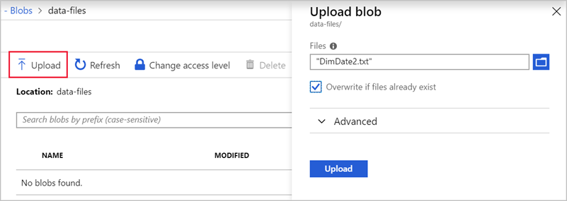

PolyBase can read data from several file formats and data sources. Before you upload your data into Azure Synapse Analytics, you must prepare the source data into an acceptable format for PolyBase. These formats include:

- Comma-delimited text files (UTF-8 and UTF-16).
- Hadoop file formats, such as RC files, Optimized Row Columnar (ORC) files, and Parquet files.
- Gzip and Snappy compressed files.

If the data is coming from a relational database, such as Microsoft SQL Server, pull the data, and then load it into an acceptable data store, such as an Azure Blob storage account. Tools such as SQL Server Integration Services can ease this transfer process.

Let's take some sample data and upload it to our Blob storage container.

> [!NOTE]
> This exercise is optional. If you don't have an Azure account, or prefer not to do the exercise in your account, read the instructions to understand how to upload a text file to Azure Blob storage.

## Obtain the source data

Our data processing department has exported the data we need into a comma-delimited file. Let's import that data into the blob container we previously created.

Start by downloading the [sample data file](https://raw.githubusercontent.com/MicrosoftDocs/mslearn-implement-azure-sql-data-warehouse/master/import-data-into-asdw-with-polybase/DimDate2.txt) to your local computer. The file contains time and data information with details about each entry.

The text file is named `DimDate2.txt` and has 1,188 rows, or lines, of data. Each line of data is separated into 12-column values by using commas. Here's a sample of the data file:

```text
2011-01-01 00:00:00.000,20110102,1,Jan,Q1,2011,2011-Q1,2011-Jan,2011-01,1,Sun,2
2011-01-02 00:00:00.000,20110103,1,Jan,Q1,2011,2011-Q1,2011-Jan,2011-01,2,Mon,3
2011-01-03 00:00:00.000,20110104,1,Jan,Q1,2011,2011-Q1,2011-Jan,2011-01,3,Tue,4
2011-01-04 00:00:00.000,20110105,1,Jan,Q1,2011,2011-Q1,2011-Jan,2011-01,4,Wed,5
...
```

## Import data into blob storage

Let's upload the data into the blob container.

1. Sign in to the [Azure portal](https://portal.azure.com?azure-portal=true) with the Azure account you created the storage account in.

1. Select **All resources**, and in the **Search** box, enter **demodwstorage**. Select your storage account from the results.

1. Select **Containers** from the **Blob service** section in the storage account.

1. Select the container named **data-files**, and open it.

1. Select the **Upload** icon from the top menu. In the **Upload blob** pane on the right, browse and select the **DimDate2.txt** file you downloaded.

    

1. After the file is uploaded, close the **Upload blob** pane. The file appears in your blob container. Select **Upload**.
