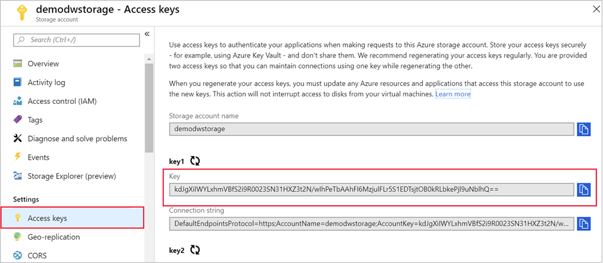
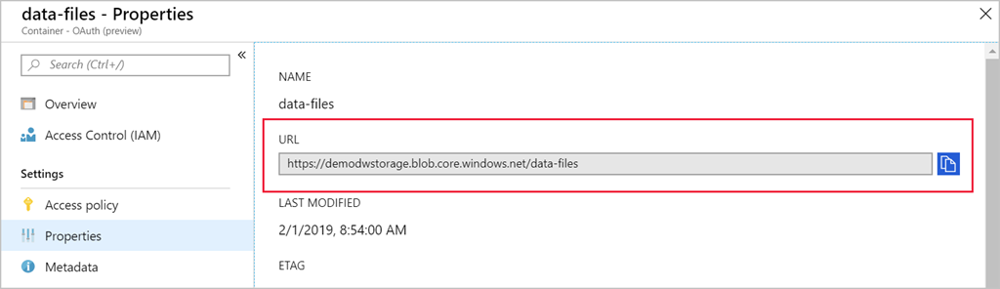

Clients and applications must be authenticated to connect to an Azure Blob storage account. There are several ways to do this. The easiest approach for trusted applications is to use the _storage key_. Because we're managing the import process, let's use this approach.

We need two pieces of information to connect PolyBase to the Azure Storage account:

- URL of the storage account
- Private storage key

Use the Azure portal to get both of these values.

> [!NOTE]
> This exercise is optional. If you don't have an Azure account, or prefer not to do the exercise in your account, read the instructions to understand how to retrieve the access keys to an Azure Storage account.

1. Sign in to the [Azure portal](https://portal.azure.com?azure-portal=true).

1. In the storage account we've previously created, under **Settings**, select **Access keys**.

1. On the **Access keys** pane, select **Show keys**, and copy the value of **key1** by selecting the *Copy to clipboard* icon at the end of the field. Save it to a temporary file, for example in Notepad. The value is used in the next unit.

    

1. Next, go to your blob container by selecting the **Containers** section of the storage account under the **Blob service** section in the nav bar. Select the **data-files** container.

1. Select **Properties** under the **Settings** section in the nav bar.

1. Copy the **URL** to the container. It should be something like `https://demodwstorage.blob.core.windows.net/data-files`.

    

    You will be manipulating the URL using the location **demodwstorage.blob.core.windows.net** and the container **data-files**. They become important when you import data from blob storage to Azure Synapse Analytics by using PolyBase in the next unit

1. Save the URL into the same text file you previously created.

> [!IMPORTANT]
> The Storage account access keys allow _full-access_ to the contents in the storage account. Never disclose these keys to untrusted parties or third-party applications. For more information on how to manage the security of your storage account, see the [Secure your Azure Storage account](https://docs.microsoft.com/learn/modules/secure-azure-storage-account/) module.
