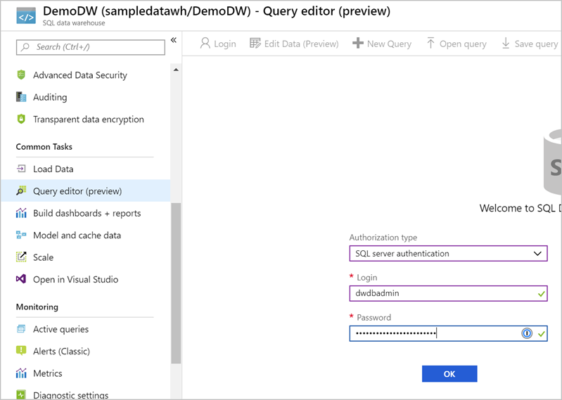

You can now import the data from the blob storage to the Azure SQL Data Warehouse database. Let's connect to the database and execute the appropriate SQL queries to create a staging table with our data.

> [!NOTE]
> This exercise is optional. If you don't have an Azure account, or prefer not to do the exercise in your account, you can read through the instructions to understand the steps involved in executing PolyBase T-SQL commands to import data from a Blob storage account into a SQL Data Warehouse.

## Open the query editor in the Azure portal

We're going to use a built-in query editor in the Azure portal to execute the necessary queries. However any query tool that supports connecting to an Azure SQL Server instance can be used. Some common free tools you can use on Windows are Visual Studio and SQL Server Management Studio (SMSS). On Linux and macOS, you can use Visual Studio Code with the **mssql** extension.

1. Sign into the [Azure portal](https://portal.azure.com?azure-portal).

1. Select **SQL database** in the left sidebar. If it's not present, you can search for the database by name with the search box at the top.

    

1. Select the name of the target database where you want to import the data (**DemoDW**).

1. Select **Query editor (preview)** from the **Common tools** section. This is a built-in SQL query editor.

    

    > [!TIP]
    > You can launch Visual Studio from here as well if you prefer to work with a desktop-based tool.

1. Enter the admin/password credentials you used to create the database with earlier and click **OK** to authenticate. You should see the query explorer.

    

## Create an import database

The first step in using PolyBase is to create a database scoped credential that secures the credentials to the Azure Blob store. This involves creating a master key first, and then using this key to encrypt the database scoped credential named **AzureStorageCredential**.

1. Paste the code below into the query window. Make sure to replace the `SECRET` value with the access key you retrieved in the previous exercise.

```sql
CREATE MASTER KEY;

CREATE DATABASE SCOPED CREDENTIAL AzureStorageCredential
WITH
    IDENTITY = 'DemoDwStorage',
    SECRET = 'THE-VALUE-OF-THE-ACCESS-KEY' -- put key1's value here
;
```

1. Click the **Run** button to execute the query. It should report `Query succeeded: Affected rows: 0.`

## Create external data source connection

The next step is to take the database scoped credential and use it to create an external data source named **AzureStorage**. Note the location URL point to the container you created (**data-files**) in the Azure Blob store. The Type **Hadoop** is used for both Hadoop-based and Azure blob-based access.

1. Paste the code below into the query window. Make sure to replace the `LOCATION` value with your correct value from the previous exercise.

```sql
CREATE EXTERNAL DATA SOURCE AzureStorage
WITH (
    TYPE = HADOOP,
    LOCATION = 'wasbs://data-files@demodwstorage.blob.core.windows.net',
    CREDENTIAL = AzureStorageCredential
);
```

1. Click the **Run** button to execute the query. It should report `Query succeeded: Affected rows: 0.`.

## Define the import file format

The next step is to define the external file format named **TextFile**. This indicates to PolyBase that the format of the text file is **DelimitedText** and the field terminator is a comma.

1. Paste the following code into the query window.

```sql
CREATE EXTERNAL FILE FORMAT TextFile
WITH (
    FORMAT_TYPE = DelimitedText,
    FORMAT_OPTIONS (FIELD_TERMINATOR = ',')
);
```

1. Click the **Run** button to execute the query. It should report `Query succeeded: Affected rows: 0.`.

## Create temporary table

Next, we need to create an external table named `dbo.temp` with the column definition for your table. At the bottom of the query, you will use a `WITH` clause to call the data source definition named **AzureStorage** (defined above) and the file format named **TextFile** (defined above). The location denotes that the files for the load are in the root folder of the data source.

> [!NOTE]
> External tables are in-memory tables that do not persist onto the physical disk. These can be queried like any other table.

The table definition needs to match the fields defined in the input file. So we have 12 defined columns, with data types that match the input file data.

1. Add the code below into the Visual Studio window below the previous code.

```sql
-- Create a temp table to hold the imported data
CREATE EXTERNAL TABLE dbo.Temp (
    [Date] datetime2(3) NULL,
    [DateKey] decimal(38, 0) NULL,
    [MonthKey] decimal(38, 0) NULL,
    [Month] nvarchar(100) NULL,
    [Quarter] nvarchar(100) NULL,
    [Year] decimal(38, 0) NULL,
    [Year-Quarter] nvarchar(100) NULL,
    [Year-Month] nvarchar(100) NULL,
    [Year-MonthKey] nvarchar(100) NULL,
    [WeekDayKey] decimal(38, 0) NULL,
    [WeekDay] nvarchar(100) NULL,
    [Day Of Month] decimal(38, 0) NULL
)
WITH (
    LOCATION='/',
    DATA_SOURCE=AzureStorage,
    FILE_FORMAT=TextFile
);
```

1. Click the **Run** button to execute the query. It will take a few seconds to complete, and should report `Query succeeded: Affected rows: 0.`.

## Create destination table

The next step is to create a physical table in the Data Warehouse database. In the following example, you will create a table named `dbo.StageDate` that has a clustered column store index define on all the columns and use a table geometry of `round_robin`. This is by design as `round_robin` is the best table geometry to use for loading data.

1. Paste the following code into the query window.

```sql
-- Load the data from Azure blob storage to SQL Data Warehouse
CREATE TABLE [dbo].[StageDate]
WITH (   
    CLUSTERED COLUMNSTORE INDEX,
    DISTRIBUTION = ROUND_ROBIN
)
AS
SELECT * FROM [dbo].[Temp];
```
1. Click the **Run** button to execute the query. It will take a few seconds to complete, and should report `Query succeeded: Affected rows: 0.`.

## Add statistics onto columns to improve query performance

Finally, as an optional step, you can create statistics on columns that feature in queries to improve the query performance against the table.

1. Paste the following code into the query window.

```sql
-- Create statistics on the new data
CREATE STATISTICS [DateKey] on [StageDate] ([DateKey]);
CREATE STATISTICS [Quarter] on [StageDate] ([Quarter]);
CREATE STATISTICS [Month] on [StageDate] ([Month]);
```

1. Click the **Run** button to execute the query. It should report `Query succeeded: Affected rows: 0.`.

Congratulations, you've loaded your first staging table in Azure SQL Data Warehouse. From here, you can write further Transact-SQL queries to perform transformations into dimension and fact tables. Try it out by querying the `StageDate` table in the query explorer, or in another query tool. You can refresh the left-hand view and see your new table(s) created. In addition, you can reuse the steps above in a persistent SQL script to load additional data as necessary.