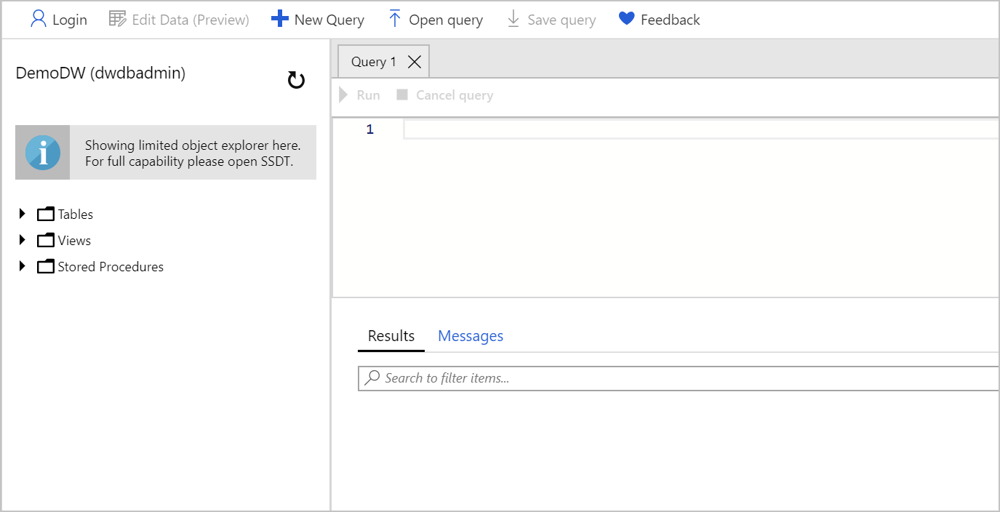

You can now import the data from the blob storage to the Azure Synapse Analytics database. Let's connect to the database and run the appropriate SQL queries to create a staging table with the data.

> [!NOTE]
> This exercise is optional. If you don't have an Azure account, or prefer not to do the exercise in your account, read the instructions to understand how to run PolyBase T-SQL commands to import data from an Azure Blob storage account into a Azure Synapse Analytics.

## Open the query editor in the Azure portal

You use a built-in query editor in the Azure portal to run the necessary queries. You can use any query tool that supports connecting to an Azure SQL Server instance. Some common free tools you can use on Windows are Visual Studio and SQL Server Management Studio. On Linux and macOS, you can use Visual Studio Code with the mssql extension.

1. Sign in to the [Azure portal](https://portal.azure.com?azure-portal).

1. Select **SQL database** in the nav bar. If it's not present, use the search box at the top to search for the database by name.

    

1. Select **demodw** as the name of the target database where you want to import the data.

1. In the nav bar, under the **Overview** section, select **Query editor (preview)**. This tool is a built-in SQL query editor.

    > [!TIP]
    > If you want to work with a desktop-based tool, you can open Visual Studio from here.

1. Enter the admin or password credentials you used to create the database, and select **OK** to authenticate. The query explorer appears.

    

## Create an import database

The first step in using PolyBase is to create a database-scoped credential that secures the credentials to the blob storage. Create a master key first, and then use this key to encrypt the database-scoped credential named **AzureStorageCredential**.

1. Paste the following code into the query window. Replace the `SECRET` value with the access key you retrieved in the previous exercise.

    ```sql
    CREATE MASTER KEY;
    
    CREATE DATABASE SCOPED CREDENTIAL AzureStorageCredential
    WITH
        IDENTITY = 'demodwStorage',
        SECRET = 'THE-VALUE-OF-THE-ACCESS-KEY' -- put key1's value here
    ;
    ```

1. Select **Run** to run the query. It should report `Query succeeded: Affected rows: 0.`

## Create an external data source connection

Use the database-scoped credential to create an external data source named **AzureStorage**. Note the location URL point to the container named **data-files** that you created in the blob storage. The type **Hadoop** is used for both Hadoop-based and Azure Blob storage-based access.

1. Paste the following code into the query window. Replace the `LOCATION` value with your correct value from the previous exercise.

    ```sql
    CREATE EXTERNAL DATA SOURCE AzureStorage
    WITH (
        TYPE = HADOOP,
        LOCATION = 'wasbs://data-files@demodwstorage.blob.core.windows.net',
        CREDENTIAL = AzureStorageCredential
    );
    ```

1. Select **Run** to run the query. It reports `Query succeeded: Affected rows: 0.`.

## Define the import file format

Define the external file format named **TextFile**. This name indicates to PolyBase that the format of the text file is **DelimitedText** and the field terminator is a comma.

1. Paste the following code into the query window.

    ```sql
    CREATE EXTERNAL FILE FORMAT TextFile
    WITH (
        FORMAT_TYPE = DelimitedText,
        FORMAT_OPTIONS (FIELD_TERMINATOR = ',')
    );
    ```

1. Select **Run** to run the query. It reports `Query succeeded: Affected rows: 0.`.

## Create a temporary table

Create an external table named `dbo.temp` with the column definition for your table. At the bottom of the query, use a `WITH` clause to call the data source definition named **AzureStorage**, as previously defined, and the file format named **TextFile**, as previously defined. The location denotes that the files for the load are in the root folder of the data source.

> [!NOTE]
> External tables are in-memory tables that don't persist onto the physical disk. External tables can be queried like any other table.

The table definition must match the fields defined in the input file. There are 12 defined columns, with data types that match the input file data.

1. Add the following code into the Visual Studio window underneath the previous code.

    ```sql
    -- Create a temp table to hold the imported data
    CREATE EXTERNAL TABLE dbo.Temp (
        [Date] datetime2(3) NULL,
        [DateKey] decimal(38, 0) NULL,
        [MonthKey] decimal(38, 0) NULL,
        [Month] nvarchar(100) NULL,
        [Quarter] nvarchar(100) NULL,
        [Year] decimal(38, 0) NULL,
        [Year-Quarter] nvarchar(100) NULL,
        [Year-Month] nvarchar(100) NULL,
        [Year-MonthKey] nvarchar(100) NULL,
        [WeekDayKey] decimal(38, 0) NULL,
        [WeekDay] nvarchar(100) NULL,
        [Day Of Month] decimal(38, 0) NULL
    )
    WITH (
        LOCATION='../',
        DATA_SOURCE=AzureStorage,
        FILE_FORMAT=TextFile
    );
    ```

1. Select **Run** to run the query. It takes a few seconds to complete and reports `Query succeeded: Affected rows: 0.`.

## Create a destination table

Create a physical table in the Azure Synapse Analytics database. In the following example, you create a table named `dbo.StageDate`. The table has a clustered column store index defined on all the columns. It uses a table geometry of `round_robin` by design because `round_robin` is the best table geometry to use for loading data.

1. Paste the following code into the query window.

    ```sql
    -- Load the data from Azure Blob storage to Azure Synapse Analytics
    CREATE TABLE [dbo].[StageDate]
    WITH (   
        CLUSTERED COLUMNSTORE INDEX,
        DISTRIBUTION = ROUND_ROBIN
    )
    AS
    SELECT * FROM [dbo].[Temp];
    ```

1. Select **Run** to run the query. It takes a few seconds to complete and reports `Query succeeded: Affected rows: 0.`.

## Add statistics onto columns to improve query performance

As an optional step, create statistics on columns that feature in queries to improve the query performance against the table.

1. Paste the following code into the query window.

    ```sql
    -- Create statistics on the new data
    CREATE STATISTICS [DateKey] on [StageDate] ([DateKey]);
    CREATE STATISTICS [Quarter] on [StageDate] ([Quarter]);
    CREATE STATISTICS [Month] on [StageDate] ([Month]);
    ```

1. Select **Run** to run the query. It reports `Query succeeded: Affected rows: 0.`.

You've loaded your first staging table in Azure Synapse Analytics. From here, you can write further Transact-SQL queries to perform transformations into dimension and fact tables. Try it out by querying the `StageDate` table in the query explorer or in another query tool. Refresh the view on the left to see the new table or tables that you created. Reuse the previous steps in a persistent SQL script to load additional data, as necessary.
