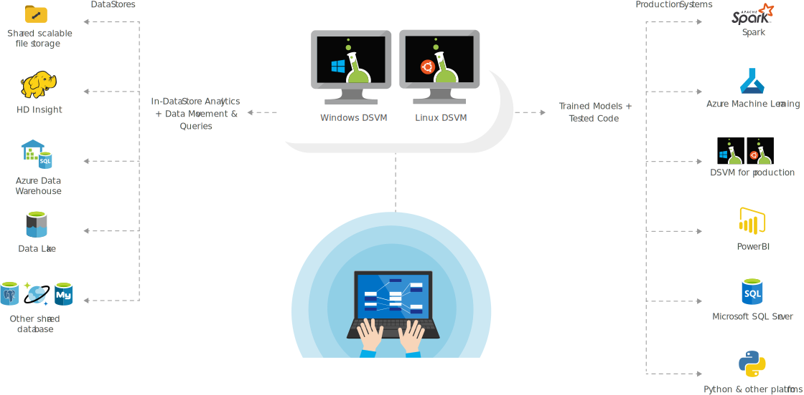

Data scientists often use many tools to do their job. Microsoft Azure provides some preconfigured virtual machine (VM) images specifically designed for data science work. These machines come preinstalled with the most popular data science tools and frameworks. 

You can use both Windows-based and Linux-based VMs. Using one of these preconfigured machines allows you to begin the data science process right away. Although most of the popular data science software comes preinstalled, you can easily install any additional software you need.

## Learning objectives

In this module, you will:

- Learn about the types of Data Science Virtual Machines
- Learn what type of DSVM to use for each type of use case