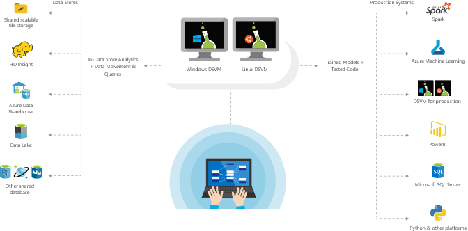

As a data scientist, you often use many tools to do your job. Azure provides some pre-configured virtual machine images specifically designed for data science work. These machines come with the most popular data science tools and frameworks pre-installed. Both Windows and Linux based virtual machines are available. Using one of these pre-configured machines allows you to begin the data science process right away. Although most of the popular data science software come pre-installed, you can easily install any additional software you need.

## Learning objectives

In this module, you will:

- Learn about the types of Data Science Virtual Machines.
- Learn what type of Data Science Virtual Machine to use for each type of use case.