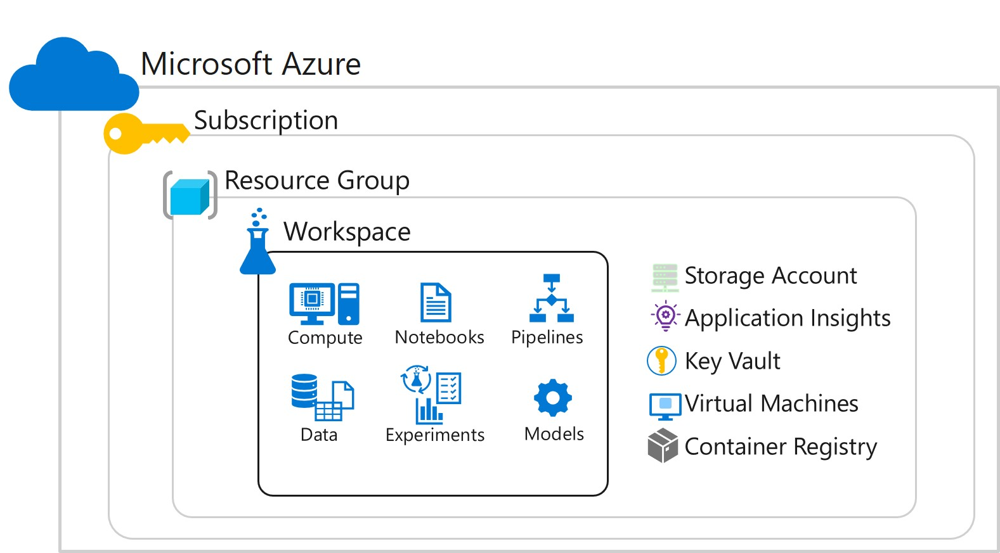

A workspace is a context for the experiments, data, compute targets, and other assets associated with a machine learning workload.

## Workspaces for Machine Learning Assets

A workspace defines the boundary for a set of related machine learning assets. You can use workspaces to group machine learning assets based on projects, deployment environments (for example, test and production), teams, or some other organizing principle. The assets in a workspace include:

- Compute targets for development, training, and deployment.
- Data for experimentation and model training.
- Notebooks containing shared code and documentation.
- Experiments, including run history with logged metrics and outputs.
- Pipelines that define orchestrated multi-step processes.
- Models that you have trained.

## Workspaces as Azure Resources

Workspaces are Azure resources, and as such they are defined within a resource group in an Azure subscription, along with other related Azure resources that are required to support the workspace.



The Azure resources created alongside a workspace include:

- A storage account - used to store files used by the workspace as well as data for experiments and model training.
- An Application Insights instance, used to monitor predictive services in the workspace.
- An Azure Key Vault instance, used to manage secrets such as authentication keys and credentials used by the workspace.
- Virtual Machines, and their associated virtual hardware resources, used to provide compute for notebook development in the workspace.
- A container registry, used to manage containers for deployed models.

### Role-Based Access Control

You can assign role-based authorization policies to a workspace, enabling you to manage permissions that restrict what actions specific Azure Active Directory (AAD) principals can perform. For example, you could create a policy that allows only users in the **IT Operations** group to create compute targets and datastores, while allowing users in the **Data Scientists** group to create and run experiments and register models.

## Creating a Workspace

You can create a workspace in any of the following ways:

- In the Microsoft Azure portal, create a new **Machine Learning** resource, specifying the subscription, resource group, workspace name, and workspace edition.
- Use the Azure Machine Learning Python SDK to run code that creates a workspace. For example:

```Python
    from azureml.core import Workspace
    
    ws = Workspace.create(name='aml-workspace', 
                      subscription_id='123456-abc-123...',
                      resource_group='aml-resources',
                      create_resource_group=True,
                      location='eastus',
                      sku='enterprise'
                     )

```

- Use the Azure Command Line Interface (CLI) with the Azure Machine Learning CLI extension. For example, you could use the following command (which assumes a resource group named *aml-resources* has already been created):

```bash
    az ml workspace create -w 'aml-workspace' -g 'aml-resources'
```

- Create an Azure Resource Manager template. For more information the template format for an Azure Machine Learning workspace, see the [Azure Machine Learning documentation](https://aka.ms/AA70rq4).

## Considerations for Creating a Workspace

When planning to create an Azure Machine Learning workspace, there are some options you should consider.

### Region

Your workspace will be created in an Azure region, which determines the data center in which the workspace resources will be hosted. You should ensure that the region where you create the workspace will support the resources you will need.

For example, you might need to create virtual machines in your workspace to support notebook development or model training. If you intend to leverage graphical processing unit (GPU) processing, which are commonly used to perform training of deep neural network (DNN) models, then you should ensure that the region where your workspace is hosted supports the appropriate series of virtual machines (for example, NC-series virtual machines support vGPUs, but are not available in all regions).

> [!TIP] 
> You can check for specific resource availability by region in the [Azure Global Infrastructure *products available by region* page](https://aka.ms/AA70zfd).

### Edition

Azure Machine Learning workspaces are available in two editions:

- *Enterprise* - includes all features.
- *Basic* - includes core features, but does not include *Designer* or graphical tools for automated machine learning or data drift monitoring.

> [!TIP] 
> You can upgrade from *Basic* to *Enterprise* edition at any time.
