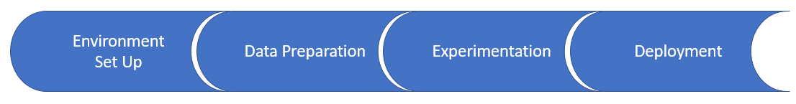

To understand the Azure Machine Learning service, let's consider how it fits into the machine learning development process illustrated below.

## Environment setup

You start by creating a *workspace*, which is a place in Azure for you to store machine learning work. You can create a workspace in the Azure portal or from within Python code. An experiment object is created within the workspace to store information about runs for the models that you train and test. You can have multiple experiment objects in a workspace.

The Azure Machine Learning service allows you to interact with a workspace by using your preferred integrated development environment (IDE), such as a local Jupyter notebook, PyCharm, or a notebook in Azure Notebooks (a cloud version of Jupyter Notebook). As you will see later in this module, it's easy to configure the environment.

## Data preparation

Before you can train a model, you must explore and analyze the source data to determine its quality and to select data for model features. Typically, this involves statistical analysis and the use of visualizations. Then, in the data wrangling step, you clean up the data and apply transformations to prepare it for use in model training.

You can use whatever Python modules you like for data preparation, including Pandas or the Azure Machine Learning Data Preparation SDK called **Azureml.dataprep**.

## Experimentation

*Experimentation* is the iterative process of model training and testing. Open-source packages like Scikit-learn, TensorFlow, and others are supported.

After building a model, you can train it locally or on a remote computer.

A key feature of the Azure Machine Learning service is the ability to run model training and evaluation in Azure containers. It's simple to monitor remote model execution and retrieve output by using the Azureml package. You also must create and configure a compute target object, which is used to provision computing resource.

After you have the model you want to use in production, you register the model in the workspace.

## Deployment

After ensuring that the model runs correctly in the local environment and is performing at the accuracy level that you want, you can deploy the model.

You will create a Docker image and then deploy it to Azure Container Instances. Note: Other target environments are available, including Azure Kubernetes Service (AKS), Azure IoT Edge, and a field programmable gate array (FPGA). For the deployment, you need the following files:

- The score scripts file is needed to decide how to run the model.
- The environment file is needed to specify package dependencies, which are important when using open-source packages.
- The configuration file is needed to request an appropriate amount of resources for the container.
