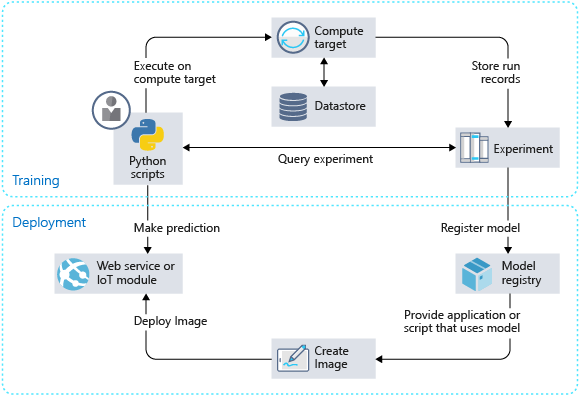

Let's consider the key components of the Azure Machine Learning service. The following diagram illustrates the data science process within the Azure Machine Learning service.

The process usually is under the umbrella of one workspace. You use Python to request compute targets and to query an experiment during the training phase. Once a model has been trained and registered, an image will be created for deployment. You can then use Python to run a deployed model in the Web service or IoT module.

Let's explore some of the key components from the above process.

## What is a Workspace?

A *workspace* is the top-level resource for the Azure Machine Learning service. It serves as a hub for building and deploying models. You can create a workspace in the Azure portal, or you can create and access it by using Python in an IDE of your choice.

All models must be registered in the workspace for future use. Together with the scoring scripts, you create an image for deployment.

The workspace stores experiment objects that are required for each model you create. Additionally, it saves your compute targets. You can track training runs, and you can retrieve logs, metrics, output, and scripts with ease. This information is important for model evaluation and selection.

## What is an Image?

As you might recall, an image has three key components:

1. A model and scoring script or application
1. An environment file that declares the dependencies that are needed by the model, scoring script, or application
1. A configuration file that describes the necessary resources to execute the model

## What is a Datastore?

A *datastore* is an abstraction over an Azure Storage account. Each workspace has a registered, default datastore that you can use right away, but you can register other Azure Blob or File storage containers as a datastore.

## What is a Pipeline?

A machine learning *pipeline* is a tool to create and manage workflows during a data science process, which typically includes data manipulation, model training and testing, and deployment phases. Each step of the process can run unattended in different compute targets, which makes it easier to allocate resources.

## What is a Compute target?

A *compute target* is the compute resource to run a training script or to host service deployment. It's attached to a workspace. Other than the local machine, users of the workspace share compute targets.

## What is a deployed Web service?

For a deployed *Web service*, you have the choices of Container Instances, AKS, or FPGAs. With your model, script, and associated files all set in the image, you can create a Web service.

## What is an IoT module?

The *IoT module* is a Docker container. As with a Web service, you will need your model, associated script or application, and any additional dependencies. See IoT Edge (https://docs.microsoft.com/azure/iot-edge/) to learn more about the service. It enables you to monitor a hosting device.
