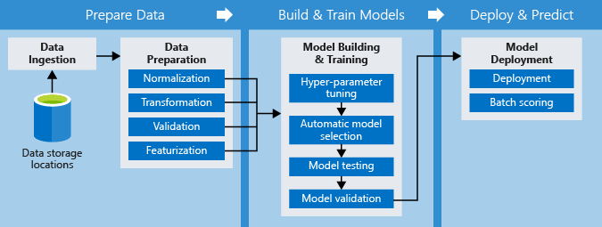

The Python SDK provides interfaces to work with Azure Machine Learning pipelines. The SDK includes imperative constructs for the sequencing and parallelization of steps. The goal is to achieve optimized execution.

All the data sources, inputs, and outputs are strictly named so that they can be reused across pipelines. The recorded intermediate tasks and data accelerate team collaboration and communication.

The following diagram is an example of a pipeline:

Here are few features of Azure Machine Learning pipelines:

- You can schedule tasks and execution, which frees up data scientists' time, especially during the data preparation phase.

- You have the flexibility to allocate compute targets for individual steps and to coordinate multiple pipelines.

- You can reuse pipeline scripts, and you can customize them for different processes; for example, in retraining and batch scoring.

- You can record and manage all input, output, intermediate tasks, and data.
