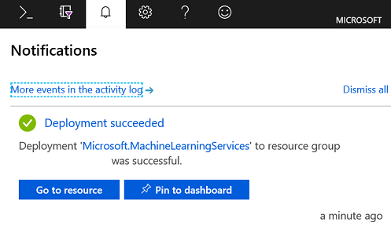

Time to finally get your hands dirty! 

In this unit, you create a new workspace and experiment. There are two ways to quickly set up a workspace, using the Azure portal and via Python code.

## Create Workspace Using Portal

Here are the quick steps

1. Login in to the Azure portal, and find the search bar on top of the dashboard
2. In the search bar, enter machine learning service workspaces, you will find the item under services, click on it


3. Click Add button on top left then enter the information needed to create the workspace. Below are descriptions for each field.


|    Field    |    Description    |
|    -----    |    -----------    |
| Workspace name | Enter a unique name for your workspace. In this example, you use **docs-ws**. The names must be unique across the resource group. Use a name that's easy to remember and different from workspaces created by others. |
| Subscription | Select the Azure subscription that you want to use. |
| Resource group | Use an existing resource group in your subscription or enter a name to create a new resource group. A resource group is a container that holds related resources for an Azure solution. In this example, you use **docs-aml**. |
| Location | Select the location closest to your users and the data resources. This location is where the workspace is created. |


4. It may take a few minutes for the workspace to be created.  The bell icon in the Azure portal will show a moving line under it while Azure is creating the workspace.  Once the line disappears, click on the bell and select 'Go to resource'.  



Click on 'Go to resource' to view the properties of the Azure Machine Learning service workspace.

## Running the code samples

Although you can use any Python IDE to use the Azure Machine Learning service, you're going to use Azure Notebooks because it has the required Python modules pre-installed.  

### What are Azure Notebooks?

Azure Notebooks is a free hosted service to develop and run Jupyter notebooks in the cloud with no installation. Jupyter (formerly IPython) is an open source project that lets you easily combine markdown text, executable code (Python, R, and F#), persistent data, graphics, and visualizations onto a single, sharable canvas called a notebook.

To get started with Azure Notebooks, use this link:

https://docs.microsoft.com/azure/notebooks/quickstart-sign-in-azure-notebooks

Follow the directions on the web page to get yourself set up and started with Azure Notebooks.

There's lot of documentation at that link to help you learn how to use all the features of Azure Notebooks.

Once you have your Azure Notebook environment set up and you are logged in, follow the instructions below to use Azure Machine Learning service with Python.

1. In Azure Notebook, create a new notebook, choose the `Python 3.6` kernel. Sign in to the Azure portal if necessary.  

You already created an Azure Machine Learning service workspace in the portal so you need run the code below to get a reference to it.

```python
from azureml.core import Workspace, Experiment, Run

ws = Workspace.get(name='myworkspace',
                      subscription_id='<azure-subscription-id>', 
                      resource_group='myresourcegroup' 
                     )
```

When you run the code above, you will be prompted to log your device into Azure via the link in the output cell.  Copy the code provided, click the link, and paste the code  into the log in screen.


For parameters in workspace, refer to below table,

|    Field    |    Description    |
|    -----    |    -----------    |
| Workspace name | Enter a unique name for your workspace. In this example, you use **myworkspace**. The names must be unique across the resource group. Use a name that's easy to remember and different from workspaces created by others. |
| Subscription | Select the Azure subscription that you want to use. |
| Resource group | Use an existing resource group in your subscription or enter a name to create a new resource group. A resource group is a container that holds related resources for an Azure solution. In this example, you use **myresourcegroup**. |
| Location | Select the location closest to your users and the data resources. This location is where the workspace is created. |

Since the workspace already exists, we don't need to create it.  However, if you wanted to, you could create the workspace in Python code as shown below.  Don't run this code though since the workspace already exists. The code is just presented to show you how it would look. 

```python
import azureml.core
print(azureml.core.VERSION)

from azureml.core import Workspace

ws = Workspace.create(name='myworkspace',
                      subscription_id='<azure-subscription-id>', 
                      resource_group='myresourcegroup',
                      create_resource_group=True,
                      location='eastus2' # Or other supported Azure region   
                     )
```

2. To view the workspace details, such as associated storage, container registry, and key vault, use code below:

```python
ws.get_details()
```

3. Write a configuration file.

Details of your workspace need to be saved to a configuration Json file to the current directory.
The `write_config()` API call creates the configuration file in the current directory. The `config.json` file contains the following:

```python
{
    "subscription_id": "<azure-subscription-id>",
    "resource_group": "myresourcegroup",
    "workspace_name": "myworkspace"
}
```

This line will create the configuration file.

```python
# Create the configuration file.
ws.write_config()
```

4. Log something to the workspace with the code below.  This may take a few minutes to run.

```python
from azureml.core import Experiment

# create an experiment
exp = Experiment(workspace=ws, name='trial_exp')

# start a run
run = exp.start_logging()

# log a number
run.log('trial', 30)

# log a list (Fibonacci numbers)
run.log_list('my list', [1, 1, 2, 3, 5, 8, 13, 21, 34, 55]) 

# finish the run
run.complete()

print('Execution complete')
```

5. View logged results using the code below.

```python
   print(run.get_portal_url())
```

The link directs you to logged values in the Azure portal

6. Clean up resources

If you are going to continue with this Learning Path, don't run the code below.  If you are done and do not plan to continue with the other modules, you can run the code below to delete the Azure Machine Learning service resources you created. 

```python
      ws.delete(delete_dependent_resources=True)
```