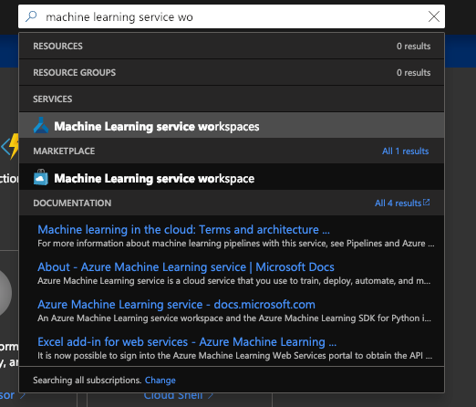
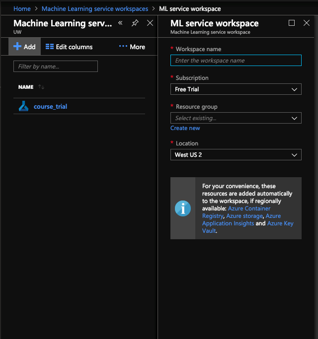
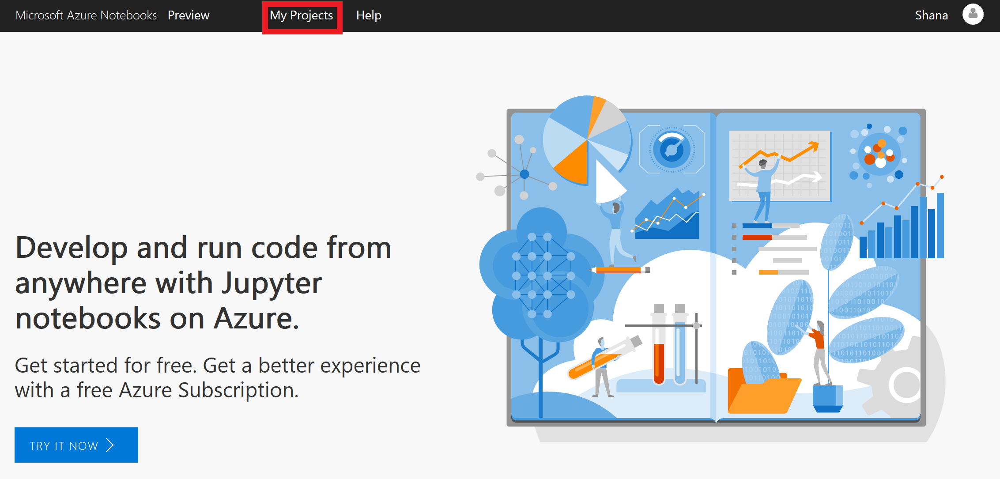
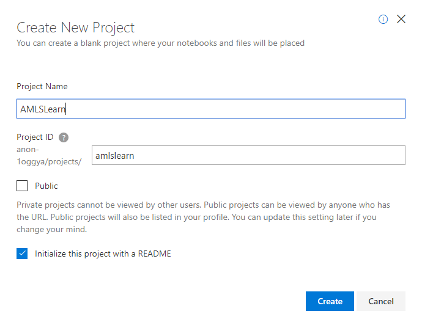
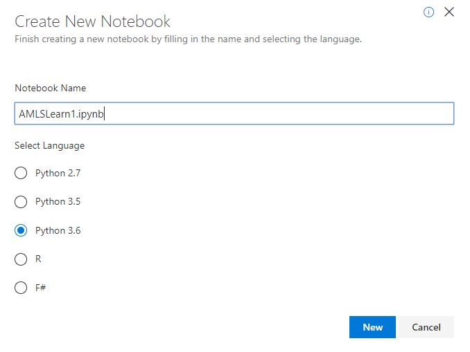
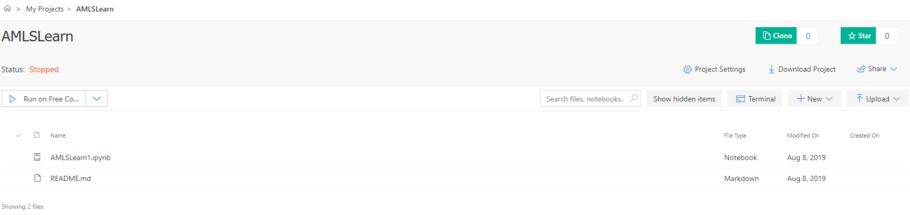

Let's create a new workspace and experiment. You can quickly set up a workspace by using the Azure portal or via Python code. We'll go through each approach here.

## Create a workspace by using the Azure portal

Follow these steps to create a workspace in the Azure portal.

1. Sign in to the [Azure portal](https://portal.azure.com?azure-portal=true]) using your Azure subscription.

1. In the Search box at the top of the portal, type **machine learning service workspaces**. 

1. Select the "Machine Learning Service Workspaces" option under SERVICES.

    

1. Select **Add** at the top left of the Machine Learning service workspaces pane, and then enter the necessary information to create the workspace.

    | Field | Description |
    |-------|-------------|
    | Workspace name | Enter a unique name for your workspace. In this example, you use **AMLSLearnworkspace**. The names must be unique across the resource group. Use a name that is easy to remember and different from workspaces that others create. |
    | Subscription | Select the Azure subscription that you want to use. |
    | Resource group | Use an existing resource group in your subscription or enter a name to create a new resource group. A *resource group* is a container that holds related resources for an Azure solution. In this example, you use **rgAMLSLearnworkspace**. |
    | Location | Select the location closest to your users and the data resources. This location is where the workspace is created. |
    
    
    

1. In the newly created workspace, select **Open Azure Notebooks** to create the first experiment.

1. Sign in with the same Microsoft account you used to create the workspace in the Azure portal.

1. After you sign in, a new tab opens and a "Clone Library" prompt appears. Select **Clone**, and then run the notebook.

1. Along with two notebooks, you will see a **Config.json** file. This configuration file contains information about the workspace that you created.

1. Select **01.run-experiment.ipynb** to open the notebook.

1. Run the cells one at a time (<kbd>Shift</kbd>+<kbd>Enter</kbd>) or select **Cells** > **Run All** to run the entire notebook. When you see an asterisk (*) next to a cell, it's running. After the code for that cell finishes, a number appears.

1. After running all the cells in the notebook, you can view the logged values in your workspace.

1. Browse back to the portal page, select **View Experiments**, and then select **my-first-experiment** to see the model run report.

## Create a workspace by using Python in an Azure Notebook

For this training, it is strongly encouraged that you use Azure Notebooks to run the code examples because they are preconfigured with everything you need.  Get your free subscription at [Free Azure Notebook Subscription](https://notebooks.azure.com/)

If you choose not to use Azure Notebooks, there are instructions later in the unit about setting up a local Jupyter Notebook environment to use Azure Machine Learning service.

Once you have your Azure Notebook subscription, log into the service.

### Create a project to store your notebooks

### Create a Notebook

The first order of business is to create a new Azure Notebook. Azure Notebooks are contained in *libraries* whose primary purpose is to group related notebooks. In this unit, you'll create a new project and then create a notebook inside it.

1. Navigate to [https://notebooks.azure.com](https://notebooks.azure.com/?azure-portal=true) in your browser.

1. Sign in using your Microsoft account. If you do  not have an account, follow the instructions to create one. 

1. Click **My Projects** in the top menubar.

    

    _Navigating to the Projects page_

1. Click **+ New Project**. Enter "AMLSLearn" (without quotation marks) for the project name and "amls-learn" as the project ID. Uncheck the **Public project** box, and then click **Create**.

    

    _Creating a project_

1. Click the **+** sign to add a notebook to the project.

    

    _Adding a notebook to the project_

1. Name the notebook "AMLSLearn1.ipynb" and select **Python 3.6 Notebook** as the item type. This will create a notebook with a Python 3.6 kernel. One of the strengths of Jupyter notebooks is that you can use different languages by choosing different kernels.

    

    _Creating a notebook_

    If you're curious, the **.ipynb** file-name extension stands for "IPython notebook." Jupyter notebooks were originally known as IPython (Interactive Python) notebooks, and they only supported Python as a programming language. The name Jupyter is a combination of Julia, Python, and R — the core programming languages that Jupyter supports.

1. Click the new notebook. This will launch the notebook and allow you to start editing it.

    

    _Opening the notebook_

You can create additional projects and notebooks as you work with Azure Notebooks. Projects provide a means for grouping related notebooks. You can create notebooks from scratch, or you can upload existing notebooks. In the next unit, you'll build a notebook from scratch and learn the basics of working with cells.

Congratulations! You have created an Azure Notebook!  You can skip to the topic _Create a workspace using Python_.  The instructions directly below are only required only if you a NOT using Azure Notebook.

## Setting up a local Jupyter Notebook environment to use Azure Machine Learning service

> [!IMPORTANT]
These instructions are only required if you must run the code samples in your local Jupyter Notebook environment and you are an experienced Python user.  It is strongly recommended that you use Azure Notebooks as described previously when learning Azure Machine Learning service because everything is preconfigured and you get the latest version of Python. 


1. Install a Python environment like Anaconda, Miniconda, or Python virtual environment.

1. Create an isolated Python environment.

1. In a command-line or terminal window, create a new Conda environment named **amlsenv** with Python 3.6:

    ```bash
    # Create
    conda create -n amlsenv -y Python=3.6
    # Activate
    conda activate amlsenv
    ```
    
1. Install the SDK.

1. Install the core components of the Machine Learning SDK and Jupyter Notebook server with the following code:

    ```bash
    # Install Jupyter
    conda install nb_conda
    
    # Install the base SDK and Jupyter Notebook
    pip install azureml-sdk[notebooks]
    ```
    
1. Start Jupyter Notebook:

    ```bash
    # Launch
    jupyter notebook
    ```
    
1. In your browser, create a new notebook, choose the `Python 3` kernel, and then sign in to the Azure portal if necessary.  Python 3.6 or higher is required to use the Python SDKs.  
 

# Create a workspace using Python

To create a workspace using Python:

1. Run the following Python code in a notebook cell replacing each of the `{placeholder}`s with the proper values for your subscription.

    ```python
    import azureml.core

    print(azureml.core.VERSION)
    
    from azureml.core import Workspace

    ws = Workspace.create(name='AMLSLearnworkspace',
                subscription_id='{azure-subscription-id}', 
                resource_group='rgAMLSLearnworkspace',
                create_resource_group = True,
                location='{location}'
                )

    print('AMLS Workspace created')

    ```
    
    |    Field    |    Description    |
    |    -----    |    -----------    |
    | Workspace name | Enter a unique name for your workspace. In this example, you use **AMLSLearnworkspace**. The names must be unique across the resource group. Use a name that is easy to remember and different from workspaces that others create. |
    | Subscription | Select the Azure subscription that you want to use. |
    | Resource group | Use an existing resource group in your subscription or enter a name to create a new resource group. A *resource group* is a container that holds related resources for an Azure solution. In this example, you use **rgAMLSLearnworkspace**. Later, if you want to remove all resources created for this Learning path training, you can just delete the resource group assuming you have not added any other Azure services to it. |
    | Location | Select the location closest to your users and the data resources. This location is where the workspace is created. |

### Understanding the code

The first thing the code above does is import the azureml.core module which provides the functions needed to interact with Azure Machine Learning service. It then prints the version to confirm a successful load. 

Then a variable ws is created and initialized with the object returned from the Workspace class Create method, i.e. the AMLS workspace is created and returned. This rich object has methods and properties that allow us to work with the Azure Machine Learning service. 


    
1. To view workspace details such as associated storage, container registry, and key vault, use the following code:

    ```python
    ws.get_details()
    ```
    
1. Write a configuration file.

    Details of your workspace can be saved to a configuration JSON file in the current directory. The `write_config()` application programming interface (API) call creates the configuration file in the current directory. The **config.json** file contains the following:

    ```json
    {
        "subscription_id": "{azure-subscription-id}",
        "resource_group": "rgAMLSLearnworkspace",
        "workspace_name": "AMLSLearnworkspace"
    }
    ```
    
1. The following code will create the configuration file:

    ```python
    # Create the configuration file.
    ws.write_config()
    print('Configuration saved')
    ```
    
1. Use the workspace:

    ```python
    from azureml.core import Experiment
    
    # create an experiment
    exp = Experiment(workspace=ws, name='trial_exp')
    
    # start a run
    run = exp.start_logging()
    
    # log a number
    run.log('trial', 30)
    
    # log a list (Fibonacci numbers)
    run.log_list('my list', [1, 1, 2, 3, 5, 8, 13, 21, 34, 55]) 
    
    # finish the run
    run.complete()

    print('Finished logging')
    ```

### Understanding the code

Work in AMLS is done inside an Experiment.  The code first imports the Experiment class from the azureml.core module.

Then the variable exp is created and initialized with an experiment object returned from the Experiment function.  The workspace object is passed as a parameter telling the function where to create the experiment.  The second parameter is the name to give the experiment in Azure.   

The experiment object that the variable 'exp' references has many methods and properties we can use. The line 'run = exp.start_logging()' creates a new object called run that can be used to reference the experiment to execute logging tasks. 

The statement 'run.log('trial', 30)' writes a line to the log containing the word 'trial' followed by the number 30.  The idea is to demonstrate you can log any information you want.

The 'run.log_list' statement demonstrates that you can pass a Python list to this method and the list will be written to the log.

The 'run.complete()' statement closes the log object similar to closing a file. 

This code sample is just to give you a flavor of how you can use the Experiment to perform tasks. 

1. View the logged results:

    ```python
    print(run.get_portal_url())
    ```
    
    The link directs you to logged values in the Azure portal.

1. Clean up the resources:

    ```python
    ws.delete(delete_dependent_resources=True)
    ```
