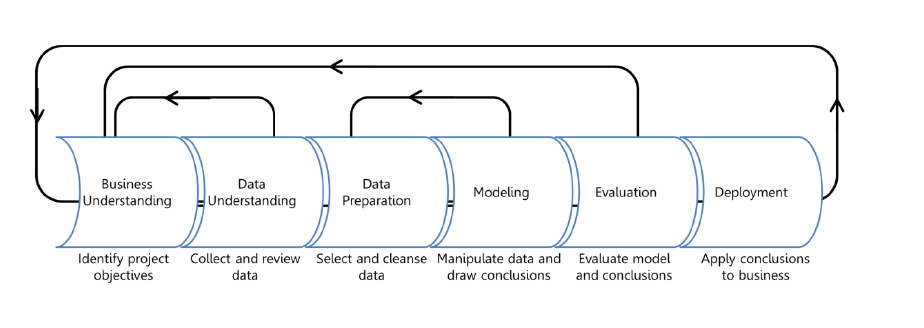

It is easy to get lost in the process because there are often many components in each step. However, the process stays the same regardless of the type of the problem that is trying to be solved.

Let's begin by defining each step and use an example to understand what each step would look like.

Let's say you work for a company that sells a variety of products, ranging from clothes to groceries to cleaning products. Management noticed they were running out of brooms before the end of each month. They wanted to solve this problem, so they decided to hire your team to help them build a solution.

## Business understanding

In any problem-solving method, the problem must first be identified. This can either be in the form of a question or a statement. There is always a general business understanding that will motivate the data science process in each situation.

In the example above, your company understands they could possibly be selling more brooms if they knew how many they could expect to sell each month and stock their shelves accordingly.

## Data understanding and data preparation

Data understanding comes from the process of acquiring and exploring available data. This step involves getting and preparing the data to be used in model training. To train models, it is important to understand the data. Data scientists start by performing exploratory data analysis (EDA) to better understand the data they're working with and which data elements drive the outcome they want to predict. With this understanding, they proceed to cleanse the data and extract the features required for modeling.

Your company gives their data to the data science team. The data engineer cleans and preps the data so that it is ready for the modeling process. EDA helps learn about the relationship among data elements which determines which data, aka features, will be needed to train the model. For example, what do people most frequently buy with brooms?

## Modeling

Within the modeling step, there is a cycle of steps that occurs to improve results. The cycle will be explained in the following unit. The modeling can consist of several techniques, but usually, one cycle iteration is not enough to produce good results, so the cycle is repeated until the desired results are achieved.

You use the data that is available and move into modeling and the feature engineering. For this type of question, where there are many different numerical variables, you try a time series model and evaluate its performance.

## Deployment

This portion of the process is usually left to the developers, but it consists of integrating the solution into the business to solve the original problem.

For your company, the deployment would mean using the prediction of broom sales to properly stock the shelves.

## Summary

Data science is a data-driven process that starts with a question. The data acquisition and understanding then drives the modeling. The steps a data scientist usually focuses on are data understanding and modeling, which is where the results are produced. After that, the developer implements the results to test the performance.