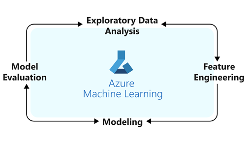
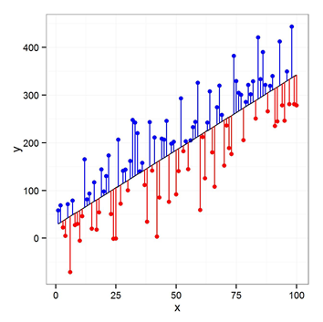

When people think of the role of a data scientist they often correlate it with machine learning modeling, which is a procedure that takes place within the data science process. In this phase, the data scientist uses EDA, feature engineering, and modeling to give a probabilistic outcome based on the data at hand.

## Understand the cycle

The modeling step is often a cycle of data understanding, feature engineering, modeling, and model evaluation. Each of the steps in the modeling cycle can take a significant amount of time. A common misconception is that the modeling step alone is data science, but the reality is each of the components of the process are vital.

Later in the module, we will describe each of the steps of the cycle. First, let's review the cycle itself.

## Exploratory Data Analysis (EDA)

Exploratory Data Analysis (EDA) can be an extremely useful step. Often, this part of the cycle will provide insight into what needs to be done during feature engineering and modeling to produce the best results. You can use different techniques depending on the types of data you are working with. A few common visualization techniques are histograms, distribution plots, box plots, and heat maps.

## Feature engineering

Feature engineering is a large part of the modeling procedure. Creating features using the data available often goes hand in hand with EDA because when you create a feature, it's important to see how it relates to the rest of the data. Therefore, you may find yourself going back and forth between EDA and feature engineering. 

Some techniques used in feature engineering are moving averages and different types of aggregations. A *moving average* is the change in average for a specific constant time interval. *Aggregations* are combinations of the data based on another feature. Some examples of aggregations are sum, average, and count.

## Modeling

A *model* is an algorithm that learns information about the data, and then provides a probabilistic prediction. Creating models is the portion of the cycle that gets the most recognition. Here, there are many different techniques available, so it's important to identify the type of problem being solved. 

Based on what you're predicting, you can use either the *classification algorithm* or the *continuous value algorithm*. A classification algorithm predicts discrete values; the continuous value algorithm predicts continuous values. 

To classify something, the only options are models that are based on these assumptions. Some examples of classification algorithm models are logistic regression and random forest classifier. The outcome predicted by a classification algorithm model is finite - it must be one of a predefined set of values. The continuous value algorithm models are numerical, and can take on an infinite number of possible values. For example, in theory, total goods sold is infinite and includes a decimal portion. In reality, factors such as number of goods produced, and number of customers constrain the range of the value. However, it is still considered continuous.

## Evaluate the model

Evaluating the model allows us to see how and where the model is doing well and/or failing. This step helps you focus in on the best model for your data. There are a few different methods that are useful depending on the type of predictive algorithm you're using. If you have a classifier model it's important to use a confusion matrix to identify misclassifications using precision and accuracy. If you are predicting numerical values, you can use evaluation metrics such as mean squared error to see on average how far away the predicted values are from the true values.

## Summary

The primary role of a data scientist is performing the model cycle tasks. The cycle always begins at EDA, but the movement from there varies depending on the data. It's common to iterate through this cycle multiple times before being satisfied with the results. At the end of this cycle, other questions may arise, creating another opportunity.
