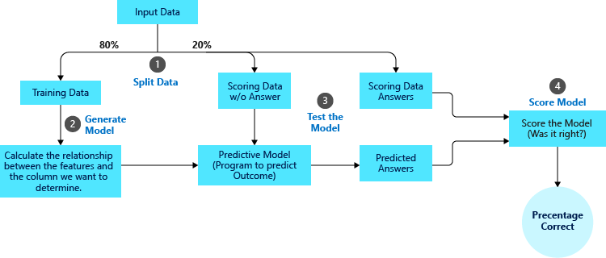

Model training is where you use the data to get a prediction. This process never looks the same because it's unique to the data available.

## Select the model

Many types of models are available, but not all of them are suitable for the outcome you want to predict. It's critical to identify whether you're trying to obtain a numerical or classification prediction. Then you can decide which type of model to use.

Because you're trying to predict the number of brooms that will sell each month, you pick an Autoregressive Integrated Moving Average (ARIMA) model. This is a modeling technique for time series analysis that helps with predictions concerning time.

## Split the data

When you train a model, you need to split your data into training and testing sets so that you don't train your model on all the data. You will need a way to test the performance of the model, which splitting the data into training and testing sets permits. The idea is to hold a subset of the data back and use it later to test the model's effectiveness. 

After you feed the data to the model, be sure you don't give it the answer; make the model predict the answer. 

Next, compare the predictions against the actual values to see how well the model performed. Data leakage, also known as *bias*, occurs when data included in the training set strongly correlates to what you're trying to predict. In other words, the training data includes information about what you're trying to predict. Predictions based on time requires you to use about 70 to 80 percent of the data for the training set, and 20 to 30 percent for the testing set. Otherwise, the train test split should be random.

When using time series data, it's essential to split the data based on time. Since our data goes from 2009 to 2014, we will use the data from 2009 to 2013 for the training set, and 2014 for the testing set.

## Cross-validate the data

When building a model, another common practice to improve model performance is cross-validation. This method splits the data into subsets of the full dataset to ensure you're not overfitting a model to one training set. *Overfitting* means that the model works well only with the data used to train it. This happens when too many data elements are used in model training. A sign of overtraining is when you get a high level of prediction accuracy, such as anything close to 100%. Cross-validation is often used in tandem with the train test split.

The data in our example is based on time, so we'll skip this step. This is because we only use cross-validation when the data used for prediction are the differences of the projections. This is often the case when a trend exists in the data.

## Obtain a probabilistic prediction

Everything we have done has led up to this point in the data science process. This is generally the glorified portion of what data scientists do. Obtaining a prediction can be simple once everything else is in place. Since you have chosen the ARIMA modeling technique, you simply call the ARIMA model and look at the results.

## Summary

This section is an overview of how to approach model training. By choosing the correct model, splitting your data into training and testing sets, and cross-validating your results, you'll improve your solution and avoid overfitting. In the next section, we'll discuss how to evaluate the model.
