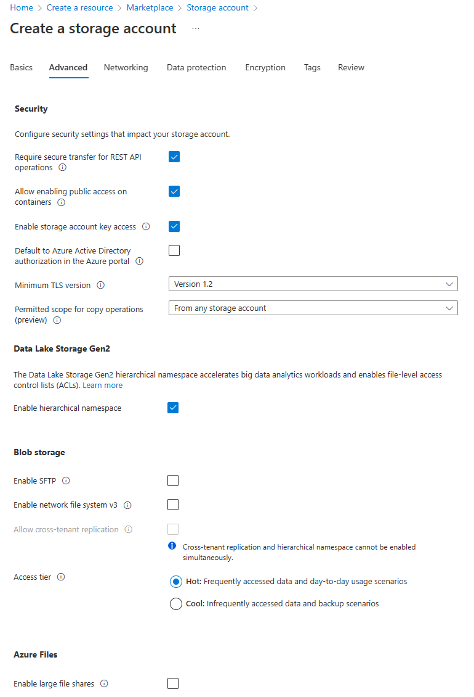
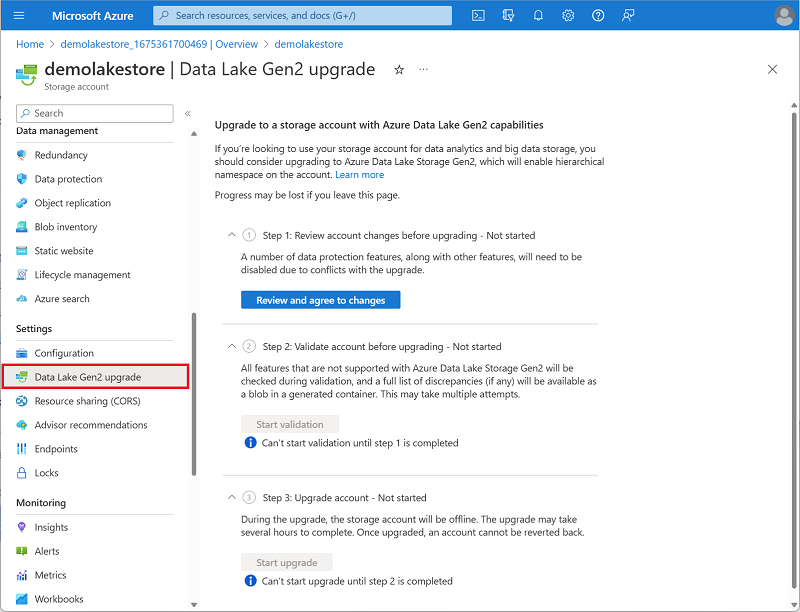

Azure Data Lake Storage Gen2 isn't a standalone Azure service, but rather a configurable capability of a **StorageV2 (General Purpose V2)** Azure Storage. 

To enable Azure Data Lake Storage Gen2 in an Azure Storage account, you can select the option to **Enable hierarchical namespace** in the **Advanced** page when creating the storage account in the Azure portal:

Alternatively, if you already have an Azure Storage account and want to enable the Azure data Lake Storage Gen2 capability, you can use the **Data Lake Gen2 upgrade** wizard in the Azure portal page for your storage account resource.

