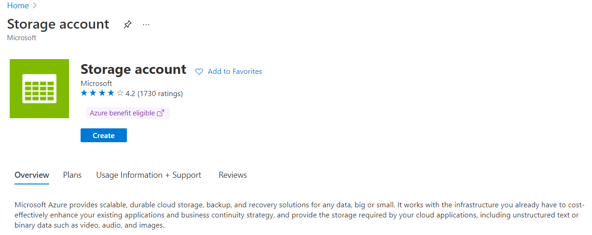
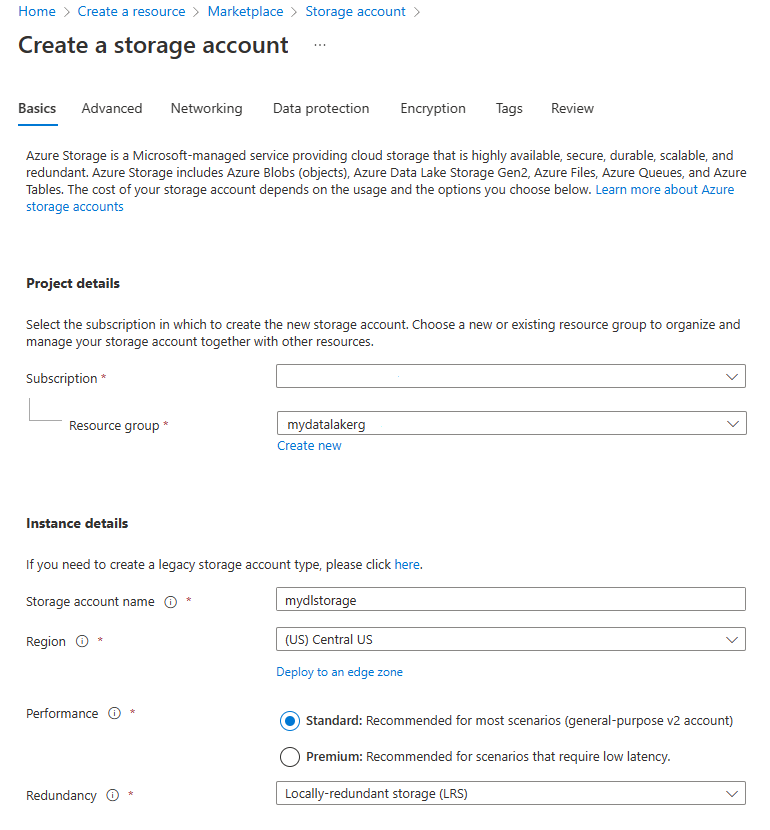

Azure Data Lake Storage Gen2 is easy to set up. It requires a **StorageV2 (General Purpose V2)** Azure Storage account with the Hierarchical namespace enabled. Let's walk through an example of setting up a Data Lake Storage account in the Azure portal.

1. Sign in to the [Azure portal](https://portal.azure.com?azure-portal=true)

1. Select **Create a resource** and in the textbox that states "Search the Marketplace type **Storage account**, and click on **Storage account**.

1. In **Storage account** screen, click **Create**.

    

1. Next, in the **Create storage account** window, in the **Basics** tab, under Project details section, ensure that your subscription is selected, and the appropriate resource group. Under the Instance section, define a **storage account name**. Set the **Region** to **Central US**. In the **Performance** radio button list, select **Standard**, and set the Redundancy to **Locally redundant storage (LRS)**.

    

1. Select the **Advanced** tab. Under the section Data Lake Storage Gen2, click the checkbox next to  **Enable hierarchical namespace**, as shown below.

    

1. Select the **Review + create** tab, and click **Create**.

This new Azure Storage account is now set up to host data for an Azure Data Lake. After the account has deployed, you will find options related to Azure Data Lake in the Overview page.