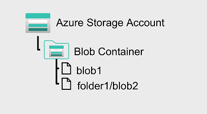
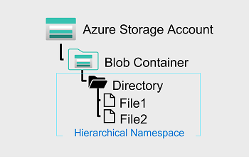

In Azure Blob storage, you can store large amounts of unstructured ("object") data in a flat namespace within a blob container. Blob names can include "/" characters to organize blobs into virtual "folders", but in terms of blob manageability the blobs are stored as a single-level hierarchy in a flat namespace.

You can access this data by using HTTP or HTTPs

 Azure Data Lake Storage Gen2 builds on blob storage and optimizes I/O of high-volume data by using a hierarchical namespace that organizes blob data into *directories*, and stores metadata about each directory and the files within it. This structure allows operations, such as directory renames and deletes, to be performed in a single atomic operation. Flat namespaces, by contrast, require several operations proportionate to the number of objects in the structure. Hierarchical namespaces keep the data organized, which yields better storage and retrieval performance for an analytical use case and lowers the cost of analysis.

 

> [!TIP]
> If you want to store data _without performing analysis on the data_, set the **Hierarchical Namespace** option to **Disabled** to set up the storage account as an Azure Blob storage account. You can also use blob storage to archive rarely used data or to store website assets such as images and media.
>
> If you are performing analytics on the data, set up the storage account as an Azure Data Lake Storage Gen2 account by setting the **Hierarchical Namespace** option to **Enabled**. Because Azure Data Lake Storage Gen2 is integrated into the Azure Storage platform, applications can use either the Blob APIs or the Azure Data Lake Storage Gen2 file system APIs to access data.
