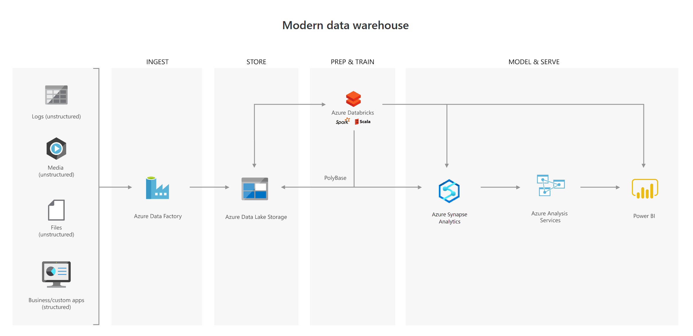
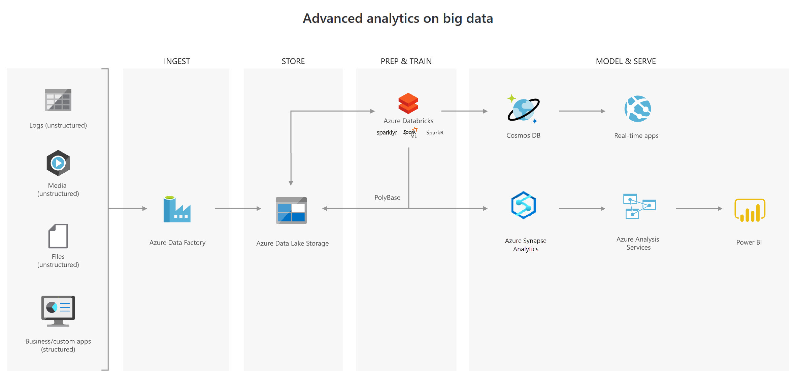
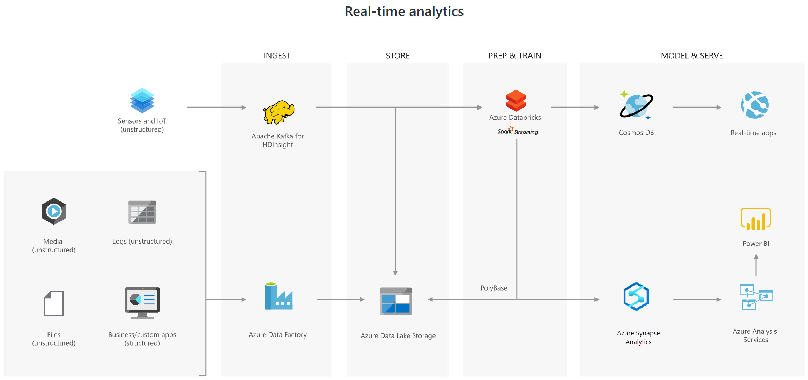

Let's examine three use cases for using an Azure Data Lake Store.

## Creating a modern data warehouse

Imagine you're a Data Engineering consultant for Contoso. In the past, they've created an on-premises business intelligence solution that used a Microsoft SQL Server Database Engine, SQL Server Integration Services, SQL Server Analysis Services, and SQL Server Reporting Services to provide historical reports. They tried using the Analysis Services Data Mining component to create a predictive analytics solution to predict the buying behavior of customers. While this approach worked well with low volumes of data, it couldn't scale after more than a gigabyte of data was collected. Furthermore, they were never able to deal with the JSON data that a third-party application generated when a customer used the feedback module of the point of sale (POS) application. 

Contoso has turned to you for help with creating an architecture that can scale with the data needs that are required to create a predictive model and to handle the JSON data so that it's integrated into the BI solution. You suggest the following architecture:

The architecture uses Azure Data Lake Storage at the center of the solution for a modern data warehouse. Integration Services is replaced by Azure Data Factory to ingest data into the Data Lake from a business application. This is the source for the predictive model that is built into Azure Databricks. PolyBase is used to transfer the historical data into a big data relational format that is held in Azure Synapse Analytics, which also stores the results of the trained model from Databricks. Azure Analysis Services provides the caching capability for SQL Data Warehouse to service many users and to present the data through Power BI reports.

## Advanced analytics for big data

In this second use case, Azure Data Lake Storage plays an important role in providing a large-scale data store. Your skills are needed by AdventureWorks, which is a global seller of bicycles and cycling components through a chain of resellers and on the internet. As their customers browse the product catalog on their websites and add items to their baskets, a recommendation engine that is built into Azure Databricks recommends other products. They need to make sure that the results of their recommendation engine can scale globally. The recommendations are based on the web log files that are stored on the web servers and transferred to the Azure Databricks model hourly. The response time for the recommendation should be less than 1 ms. You propose the following architecture: 

In this solution, Azure Data Factory transfers terabytes of web logs from a web server to the Azure Data Lake on an hourly basis. This data is provided as features to the predictive model in Azure Databricks, which is then trained and scored. The results are distributed globally by using Azure Cosmos DB, which the real-time app (the AdventureWorks website) will use to provide recommendations to customers as they add products to their online baskets.

To complete this architecture, PolyBase is used against the Data Lake to transfer descriptive data to the SQL Data Warehouse for reporting purposes. Azure Analysis Services provides the caching capability for SQL Data Warehouse to service many users and to display the data through Power BI reports.

## Real-time analytical solutions

To perform real-time analytical solutions, the ingestion phase of the architecture is changed for processing big data solutions. In this architecture, note the introduction of Apache Kafka for Azure HDInsight to ingest streaming data from an Internet of Things (IoT) device, although this could be replaced with Azure IoT Hub and Azure Stream Analytics. The key point is that the data is persisted in Data Lake Storage Gen2 to service other parts of the solution.

In this use case, you are a Data Engineer for Trey Research, an organization that is working with a transport company to monitor the fleet of Heavy Goods Vehicles (HGV) that drive around Europe. Each HGV is equipped with sensor hardware that will continuously report metric data on the temperature, the speed, and the oil and brake solution levels of an HGV. When the engine is turned off, the sensor also outputs a file with summary information about a trip, including the mileage and elevation of a trip. A trip is a period in which the HGV engine is turned on and off.

Both the real-time data and batch data is processed in a machine learning model to predict a maintenance schedule for each of the HGVs. This data is made available to the downstream application that third-party garage companies can use if an HGV breaks down anywhere in Europe. In addition, historical reports about the HGV should be visually presented to users. As a result, the following architecture is proposed:

In this architecture, there are two ingestion streams. Azure Data Factory ingests the summary files that are generated when the HGV engine is turned off. Apache Kafka provides the real-time ingestion engine for the telemetry data. Both data streams are stored in Azure Data Lake Store for use in the future, but they are also passed on to other technologies to meet business needs. Both streaming and batch data are provided to the predictive model in Azure Databricks, and the results are published to Azure Cosmos DB to be used by the third-party garages. PolyBase transfers data from the Data Lake Store into SQL Data Warehouse where Azure Analysis Services creates the HGV reports by using Power BI.