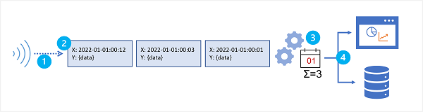

A data stream consists of a perpetual series of data, typically related to specific point-in-time events. For example, a stream of data might contain details of messages submitted to a social media micro-blogging site, or a series of environmental measurements recorded by an internet-connected weather sensor. Streaming data analytics is most often used to better understand change over time. For example, a marketing organization may perform sentiment analysis on social media messages to see if an advertising campaign results in more positive comments about the company or its products, or an agricultural business might monitor trends in temperature and rainfall to optimize irrigation and crop harvesting.

Common goals for stream analytics include

- Continuously analyzing data to report issues or trends.
- Understanding component or system behavior under various conditions to help plan future enhancements.
- Triggering specific actions or alerts when certain events occur or thresholds are exceeded.

### Characteristics of stream processing solutions

Stream processing solutions typically exhibit the following characteristics:

1. The source data stream is *unbounded* - data is added to the stream perpetually.
2. Each data record in the stream includes *temporal* (time-based) data indicating when the event to which the record relates occurred (or was recorded).
3. Aggregation of streaming data is performed over temporal *windows* - for example, recording the number of social media posts per minute or the average rainfall per hour.
4. The results of streaming data processing can be used to support real-time (or *near* real-time) automation or visualization, or persisted in an analytical store to be combined with other data for historical analysis. Many solutions combine these approaches to support both real-time and historical analytics.
