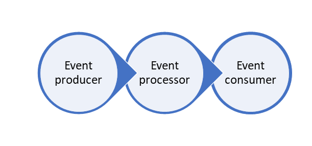
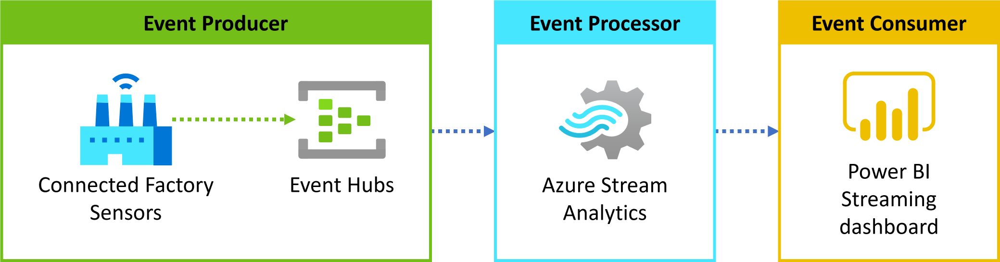

Event processing refers to the consumption and analysis of a continuous data stream to extract latent knowledge and derive actionable insights from the events happening within that stream. Event processing pipelines provide an end-to-end solution for ingesting, transforming, and analyzing data streams and are made up of three distinct components:

- An **event producer**, which generates an event data stream
- An **event processor** responsible for the ingestion and transformation of streaming event data
- An **event consumer** that displays or consumes event data and takes action on it

## Event producer 

An event producer is an application, connected device or sensor, or any other service that continuously outputs a data stream of events. Events can be any recurring action, such as a heartbeat, a car passing through a toll booth, or an engine sensor reporting temperature values on an automobile. Every event should include temporal information, such as a timestamp, indicating when it occurred.

Azure Event Hubs and IoT Hub are frequently used as event producers in Azure. These services can handle incoming events at a massive scale and produce an event stream to feed into downstream event processing services, such as Azure Stream Analytics.

## Event processor

An event processor is an engine designed to consume and transform event data streams. Event processors require the ability to query time segments easily. Performing time-boxed computations or aggregations, such as counting the number of times an event happens during a particular period, is a frequent use case. Depending on the problem space, event processors either process one incoming event at a time, such as a heart rate monitor, or process multiple events simultaneously, such as Azure Stream Analytics processing sensor data from highway tollbooths.

[Azure Stream Analytics](/azure/stream-analytics/stream-analytics-introduction) is the quickest way to get event processing running on Azure. Using Stream Analytics, you can ingest streaming data from Azure Events Hubs or IoT Hub and run real-time analytics queries against the streams.

Stream Analytics supports multiple types of windowing functions for performing temporal computations on data streams, providing a way to aggregate events over various time intervals depending on specific window definitions. It also provides the capability to use Azure Machine Learning functions to make it a robust tool for analyzing data streams.

## Event consumer

An event consumer is an application that consumes the output of an event processor. Event consumers can be used to visualize data or take a specific action based on the insights, such as generating alerts when specified thresholds are met or sending data to another event processing engine.

For visualizing and analyzing data, [Power BI](/power-bi/fundamentals/power-bi-overview) is the recommended event consumer. It provides a platform for creating complex linked visualizations and analyzing aggregated data in near-real-time. Azure Stream Analytics can output directly to Power BI, allowing dashboards to be updated continuously as data streams are processed.

## Building event processing pipelines

Event processing pipelines generally chain together multiple services to create a near-real-time analytics pipeline. The diagram below shows an example event processing pipeline built on Event Hubs, Azure Stream Analytics, and Power BI.

In this pipeline, Event Hubs ingests streaming data from sensors in a connected factory, and together they act as the event producer. The event processor is Azure Stream Analytics, which receives the data from Event Hubs and transforms and aggregates it. Power BI, the event consumer, receives output from Stream Analytics and displays rich visualizations used to analyze the event data.
