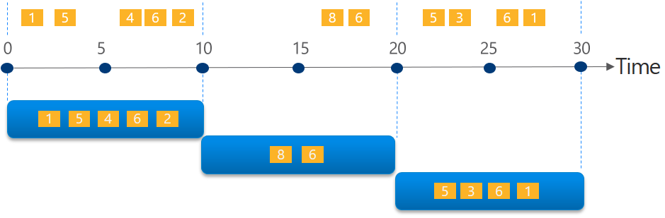
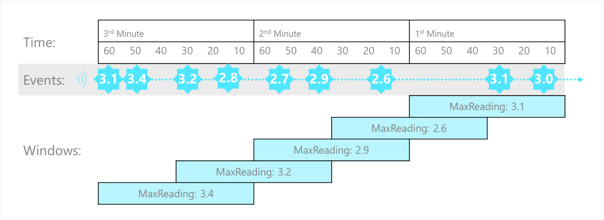
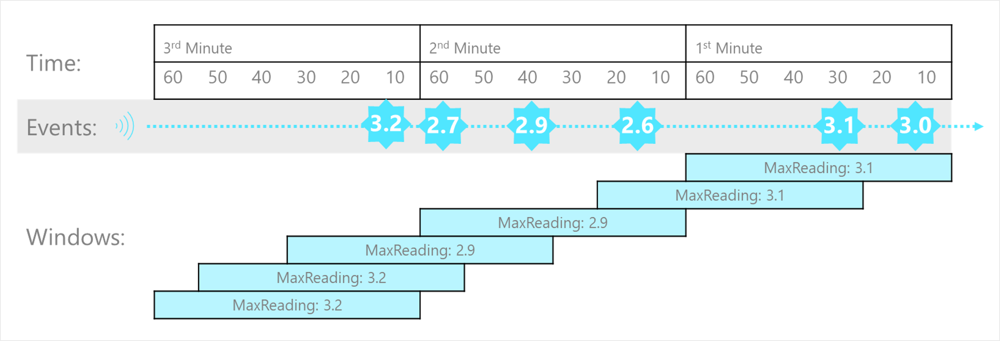
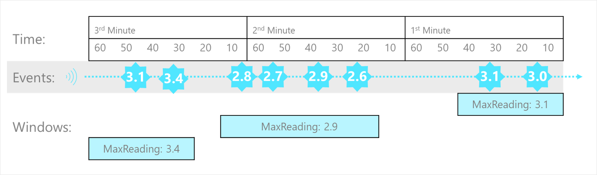
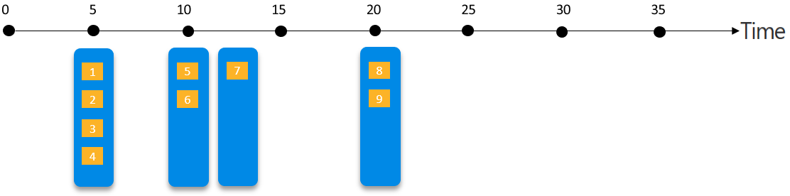

A common goal of stream processing is to aggregate events into temporal intervals, or *windows*. For example, to count the number of social media posts per minute or to calculate the average rainfall per hour.

Azure Stream Analytics includes native support for [five kinds of temporal windowing functions](/stream-analytics-query/windowing-azure-stream-analytics). These functions enable you to define temporal intervals into which data is aggregated in a query. The supported windowing functions are [Tumbling](/stream-analytics-query/tumbling-window-azure-stream-analytics), [Hopping](/stream-analytics-query/hopping-window-azure-stream-analytics), [Sliding](/stream-analytics-query/sliding-window-azure-stream-analytics), [Session](/stream-analytics-query/session-window-azure-stream-analytics), and [Snapshot](/stream-analytics-query/snapshot-window-azure-stream-analytics).

## Tumbling

**Tumbling** window functions segment a data stream into a contiguous series of fixed-size, non-overlapping time segments and operate against them. Events can't belong to more than one tumbling window.



The Tumbling window example, represented by the following query, finds the maximum reading value in each one-minute window. Windowing functions are applied in Stream Analytics jobs using the [GROUP BY](/stream-analytics-query/group-by-azure-stream-analytics) clause of the query syntax. The `GROUP BY` clause in the following query contains the `TumblingWindow()` function, which specifies a one-minute window size.

```sql
SELECT DateAdd(minute,-1,System.TimeStamp) AS WindowStart,
       System.TimeStamp() AS WindowEnd,
       MAX(Reading) AS MaxReading
INTO
    [output]
FROM
    [input] TIMESTAMP BY EventProcessedUtcTime
GROUP BY TumblingWindow(minute, 1)
```

## Hopping

**Hopping** window functions model scheduled overlapping windows, jumping forward in time by a fixed period. It's easiest to think of them as Tumbling windows that can overlap and be emitted more frequently than the window size. In fact, tumbling windows are simply a hopping window whose `hop` is equal to its `size`. When you use Hopping windows, events can belong to more than one window result set.



To create a hopping window, you must specify three parameters. The first parameter indicates the time unit, such as second, minute, or hour. The following parameter sets the window size, which designates how long each window lasts. The final required parameter is the hop size, which specifies how much each window moves forward relative to the previous one. An optional fourth parameter denoting the offset size may also be used.

The following query demonstrates using a `HoppingWindow()` where the `timeunit` is set to `second`. The `windowsize` is 60 seconds, and the `hopsize` is 30 seconds. This query outputs an event every 30 seconds containing the maximum reading value that occurred over the last 60 seconds.

```sql
SELECT DateAdd(second,-60,System.TimeStamp) AS WindowStart,
       System.TimeStamp() AS WindowEnd,
       MAX(Reading) AS MaxReading
INTO
    [output]
FROM
    [input] TIMESTAMP BY EventProcessedUtcTime
GROUP BY HoppingWindow(second, 60, 30)

```

## Sliding

**Sliding** windows generate events for points in time when the content of the window actually changes. This function model limits the number of windows that need to be considered. Azure Stream Analytics outputs events for only those points in time when an event entered or exited the window. As such, every window contains a minimum of one event. Events in Sliding windows can belong to more than one sliding window, similar to Hopping windows.



The following query uses the `SlidingWindow()` function to find the maximum reading value in each one-minute window in which an event occurred.

```sql
SELECT DateAdd(minute,-1,System.TimeStamp) AS WindowStart,
       System.TimeStamp() AS WindowEnd,
       MAX(Reading) AS MaxReading
INTO
    [output]
FROM
    [input] TIMESTAMP BY EventProcessedUtcTime
GROUP BY SlidingWindow(minute, 1)
```

## Session

**Session** window functions cluster together events that arrive at similar times, filtering out periods of time where there's no data. It has three primary parameters: timeout, maximum duration, and partitioning key (optional).



The occurrence of the first event starts a session window. Suppose another event occurs within the specified timeout from the last ingested event. In that case, the window will be extended to incorporate the new event. However, if no other events occur within the specified timeout period, the window will be closed at the timeout. If events keep happening within the specified timeout, the session window will extend until the maximum duration is reached.

The following query measures user session length by creating a `SessionWindow` over clickstream data with a `timeoutsize` of 20 seconds and a `maximumdurationsize` of 60 seconds.

```sql
SELECT DateAdd(second,-60,System.TimeStamp) AS WindowStart,
       System.TimeStamp() AS WindowEnd,
       MAX(Reading) AS MaxReading
INTO
    [output]
FROM
    [input] TIMESTAMP BY EventProcessedUtcTime
GROUP BY SessionWindow(second, 20, 60)
```

## Snapshot

**Snapshot** windows groups events by identical timestamp values. Unlike other windowing types, a specific window function isn't required. You can employ a snapshot window by specifying the `System.Timestamp()` function to your query's `GROUP BY` clause.



For example, the following query finds the maximum reading value for events that occur at precisely the same time.

```sql
SELECT System.TimeStamp() AS WindowTime,
       MAX(Reading) AS MaxReading
INTO
    [output]
FROM
    [input] TIMESTAMP BY EventProcessedUtcTime
GROUP BY System.Timestamp()
```

`System.Timestamp()` is considered in the `GROUP BY` clause as a snapshot window definition because it groups events into a window based on the equality of timestamps.
