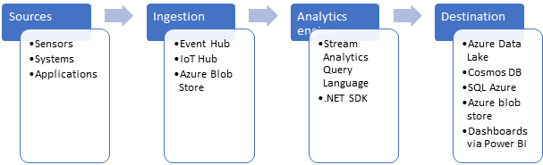

Microsoft Azure Stream Analytics is an event processing engine. It enables the consumption and analysis of high volumes of streaming data generated by sensors, devices, or applications. Stream Analytics processes the data in real time. A typical event processing pipeline built on top of Stream Analytics consists of the following four components: 

- **Event producer**: Any application, system, or sensor that continuously produces event data of interest. Examples can include a sensor that tracks the flow of water in a utility pipe to an application such as Twitter that generates tweets against a single hashtag.
- **Event ingestion system**: Takes the data from the source system or application to pass onto an analytics engine. Azure Event Hubs, Azure IoT Hub, or Azure Blob storage can all serve as the ingestion system.
- **Stream analytics engine**: Where compute is run over the incoming streams of data and insights are extracted. Azure Stream Analytics exposes the Stream Analytics query language (SAQL), a subset of Transact-SQL that's tailored to perform computations over streaming data. The engine supports windowing functions that are fundamental to stream processing and are implemented by using the SAQL.
- **Event consumer**: A destination of the output from the stream analytics engine. The target can be storage, such as Azure Data Lake, Azure Cosmos DB, Azure SQL Database, or Azure Blob storage, or dashboards powered by Power BI.

## Operational aspects

Stream Analytics guarantees *exactly once* event processing and *at-least-once* event delivery, so events are never lost. It has built-in recovery capabilities in case the delivery of an event fails. Also, Stream Analytics provides built-in checkpointing to maintain the state of your job and produces repeatable results.

Because Azure Stream Analytics is a PaaS service, it's fully managed and highly reliable. Its built-in integration with various sources and destinations and flexible programmability model enhance programmer productivity. The Stream Analytics engine enables in-memory compute, so it offers superior performance. All these factors contribute to low total cost of ownership (TCO) of Azure Stream Analytics.