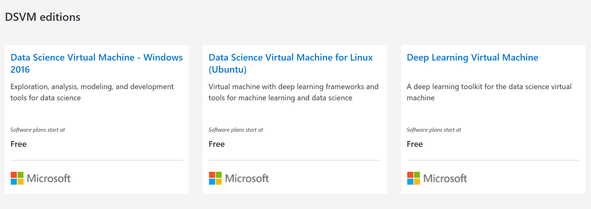
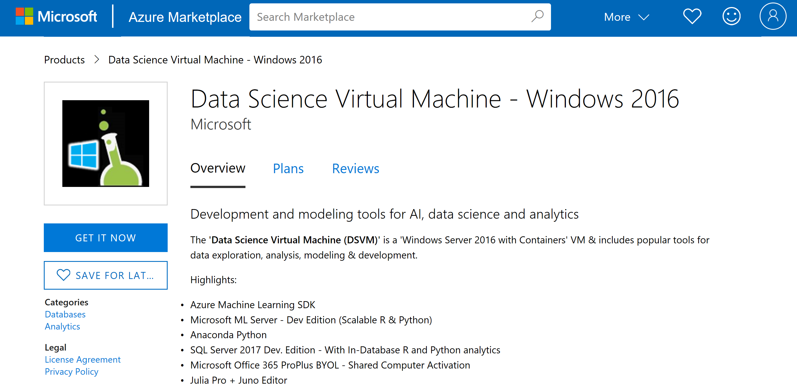
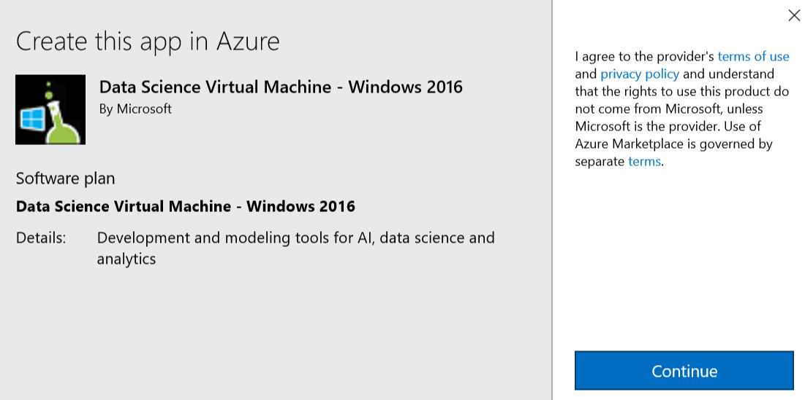
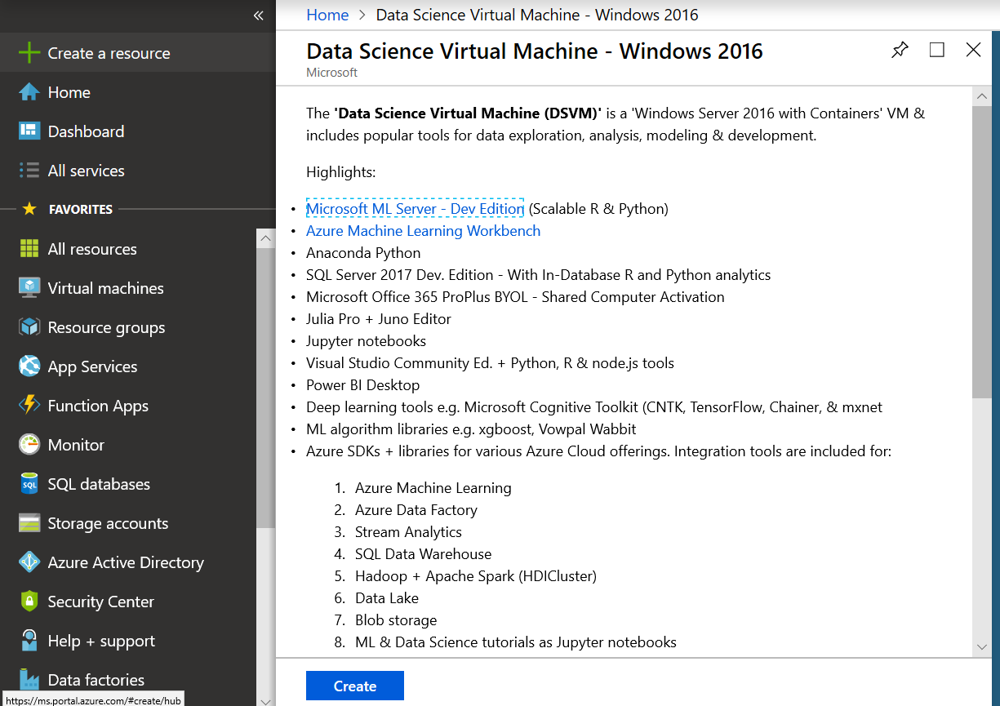

Creating an Azure Data Science VM for Linux or Windows is exactly like creating any other type of VM - we're just using a specific image. Let's create a Windows-based DSVM through the Azure portal.

You can start right in the Azure portal and use the **+ Create New Resource** support, or use the DSVM product pages. Let's use the latter for this exercise.

1. Make sure to activate the Azure Sandbox.

1. Navigate to [the Microsoft Azure Data Science Virtual Machines product page](https://azure.microsoft.com/services/virtual-machines/data-science-virtual-machines/?azure-portal=true) in a new browser window or tab.

1. Scroll down until you see the DSVM editions as shown in the following image.

    

1. Select the **Data Science Virtual Machine – Windows 2019** link.

1. On the description screen, select the **Get it now** button.

    

1. When you see the **Create this app in Azure** dialog, select **Continue**.

    

1. The browser window will take you to the Azure portal. If you are prompted for your credentials, make sure to use the same ones you used to activate the Sandbox.

1. Verify that you are using the correct Azure directory - **MICROSOFT LEARN SANDBOX**. You should see the directory under your email address in the top right of the portal window (by your profile picture). If you are _not_ in the Sandbox, you will need to change your directory with the following steps:
    1. Click the **Directory+Subscription** icon in the toolbar across the top of the portal.
        
    1. Select **All Directories** and make sure **Microsoft Learn Sandbox** is the selected choice.
    1. Verify the directory is changed under your profile picture.

1. The portal should be on the **Data Science Virtual Machine – Windows 2019** screen.

    

1. Select **Create** to begin configuring a virtual machine (VM). Set the appropriate values into each of the fields using the following suggestions.
    - **Subscription**. Verify that _Concierge Subscription_ is selected. If it's not present in the list, make sure you activated the Sandbox and are logged in with the same credentials.
    - **Resource group**. A *resource group* is a container that holds related resources for an Azure solution. Make sure the pre-created Sandbox resource group <rgn>[Sandbox Resource Group Name]</rgn> is selected.
    - **Virtual Machine name**. Enter a name for the data science server you are creating. For this example, we'll use **Win2019**.
    - **Region**.
        [!include]
    - **Image**: Do not change this setting, but verify that it says **Data Science Virtual Machine – Windows 2019**.
    - **Size**. Normally you would leave this setting alone - you want a lot of CPUs and memory to perform data science tasks. However, for this exercise, change the size to be **DS2_v2 (Standard)**.
    - **User Name**. Enter an administration account ID. You will need this later to access the VM.
    - **Password**. Enter the administration account password. You will need this later as well to access the VM.
    - **Already have a Windows license?** Leave this as the default, which is set to **No**.

1. Select **Review and Create**, it should validate and show you all the details about what is going to be provisioning. Don't worry about the section stating **Subscription credits apply**, you won't be charged.

1. Select the **Create** button to provision the DSVM.

VM provisioning takes a few minutes. You should see an icon of a blue line under a bell , which indicates that Azure is busy building the VM. After this process completes, the VM main properties window will appear.
