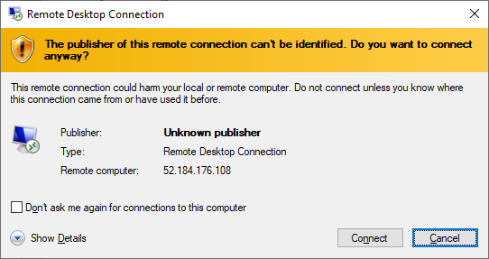

Whenever you need to access the VM, you can find it from the Azure portal. In the left panel, click "Virtual Machines" tab, you should see the DSVM you just created. Click on the name of the DSVM which will bring up the Overview screen.

Then click on "Connect".

You can open the RDP (Remote Desktop) file directly. Or you can download it and then open it with Remote Desktop Connection app. When the connection asks for the credentials, use the admin account name and password for creating the DSVM.

On the Remote Desktop Connection dialog box, click on **Connect**. Then enter the administrator user id and password you used when you created the VM.

> ![IMPORTANT]
> When the screen resolution on your client machine is high, you may get a black screen. If that happens, use Remote Desktop Connection to open the RDP file, and before connecting, click the Show Options link, click the Display tab and set the Display Configuration to a lower resolution as shown below.

The first time you log into the VM, it runs some scripts that install demonstration code and data. Wait for a few minutes to let this compete before continuing.

Now you are ready to start using the DSVM with data science tools installed and configured. Many of the tools have start menu tiles and desktop icons.

