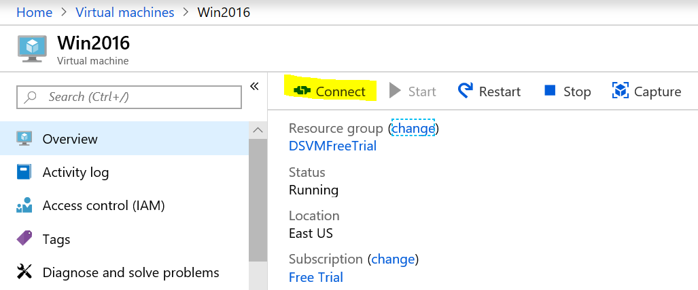
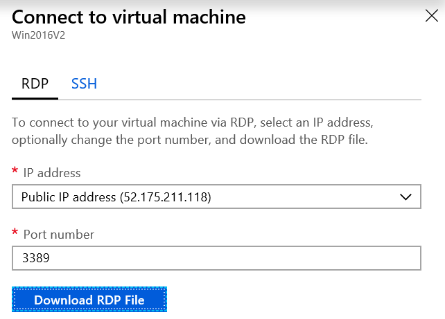
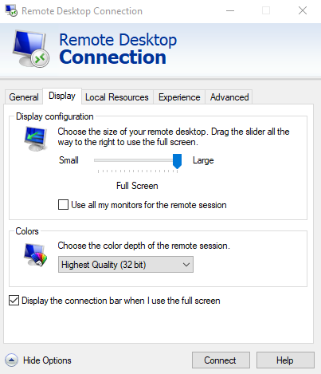
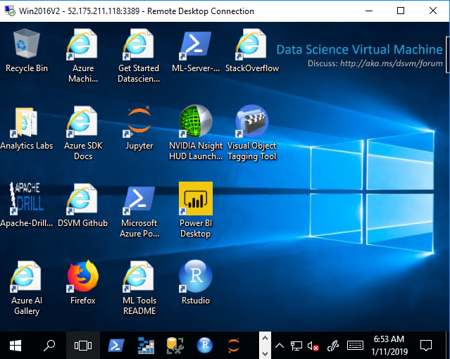

You can always access your VM from the Azure portal. Since we created a Windows VM, we will use the Remote Desktop Protocol (RDP) approach. If we had created a Linux DSVM, we would utilize a Secure Shell (SSH) tool.

## Use RDP to connect to the Windows DSVM

1. Switch back to the Azure portal.

1. In the left sidebar of the portal, select **Virtual Machines**.
1. Locate the DSVM you just created (**Win2019**) and select it. This will bring up the **Overview** pane.

    

1. From the **Overview** pane, select the **Connect**.

    

1. Select the **Download RDP file** button to download the RDP configuration using your browser. You can open the Remote Desktop Protocol (RDP) file directly, or you can download it and then open it with the Remote Desktop Connection app on Windows, macOS, or most Linux distributions.

1. In the **Remote Desktop Connection** dialog box, click **Connect** (this is for Windows - other clients might have a slightly different experience but should be similar).

    

1. Enter the administrator user ID and password that you used when you created the VM. On Windows clients it might default to your logged on user as the username - you can select the **More choices** option to allow you to enter a different username.

    > [!IMPORTANT]
    > If the screen resolution on your client machine is high, you might get a black screen. If that happens, use Remote Desktop Connection (RDC) to open the RDP file. Prior to connecting click the **Show Options** link, click the **Display** tab, and set the **Display Configuration** to a lower resolution as shown in the following illustration.
    > 
    > 

## Setting up the DSVM tools

The first time you sign into the VM, it will run some scripts that install demonstration code and data. Wait for a few minutes to let this compete before continuing.

Now that the data science tools are installed and configured, you are ready to start using the DSVM. Notice that many of the tools have start menu tiles and desktop icons.

