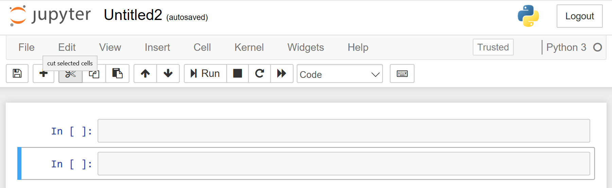

The Jupyter Notebook is a popular browser-based integrated development environment (IDE) for Data Science. You can use Jupyter Notebooks to explore data and train models. It supports both R and Python programming languages. Specifically, Python 2, Python 3, Open Source R, and the Microsoft R Server. Although notebooks support rich annotations, they are programs that can execute complete data science pipelines.

## Why use Jupyter Notebooks?

### Presentation

The Jupyter Notebook integrates code, its output, and explanatory text all into a single document. Comparing to a traditional code editor, it is great for presentation because the file can contain visualizations, tables, narrative texts, equations, etc.

### Collaboration

You can export a Jupyter Notebook to different formats. By downloading it as an HTML file, you can share the results with a small group of people. Alternatively, you can save the notebook to its native format, with the .ipynb file extension, and upload to GitHub for a more direct sharing.

### Exploratory analysis

The development process on Jupyter Notebook is very interactive. You write a small piece of code, observe the output immediately, and write another piece of code. This is consistent with what data scientists do in their day-to-day work because data science is an iterative and exploratory process.

### Many Languages Supported

Jupyter Notebooks use a kernel-based architecture which separates the language interpreter from the notebook. Any language that has a Jupyter language kernel can be used in a notebook. All popular data science languages including Python, R, Julia, and Java have kernels available. The Jupyter Notebook is a machine learning development environment for virtually any language.

To Use Jupyter Notebook, click on the start menu icon:

The interface of Jupyter Notebook is intuitive. Under the Files tab, you can see the list of folders and files in the current directory. Select the location where you want to create your notebook. Then click **New** on the right upper corner to create a new notebook and select a language (Python 3 in this example). Notice several language kernels are installed for you but you can install more if you like.

A new notebook is created, and you can see an empty code cell waiting for your input. You can run, add, remove, or edit the cells. The toolbar buttons allow you to do various operations on selected cells, for example, delete, copy, move, run, etc. There are two commonly used keyboard shortcuts listed below, and you can get a full list of keyboard shortcuts by clicking on the keyboard icon in the toolbar, . Alternatively, you can use the drop-down menus to perform actions on your notebook.

- Ctrl + Enter: to run the selected cell
- Shift + Enter: to run the selected cell, move to the next cell when the selected cell is not the last one, otherwise add a new cell.

By default, a cell is executed in the "kernel", which is a computational engine that executes the code contained in the cell. Alternatively, you could change the cell type to be "Markdown" or "Header", which are used annotations and formatted titles. Note:  The "Header" type is just a Markdown cell that has '##' characters added to format it as a header.

For more information about using Jupyter notebooks, see http://Jupyter.org.

The output from code executed in a cell is displayed in the cell immediately below in a cell labeled Out followed by the cell number in brackets as shown below.  Note:  Don't worry about the raw cell type. This cell type is used to format output when exporting the notebook using the NBConvert utility.

