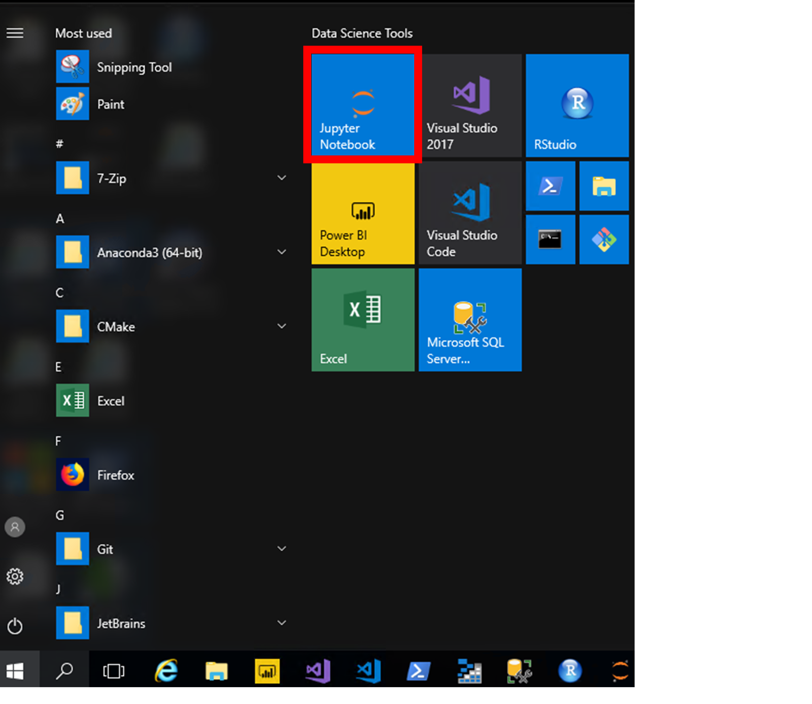
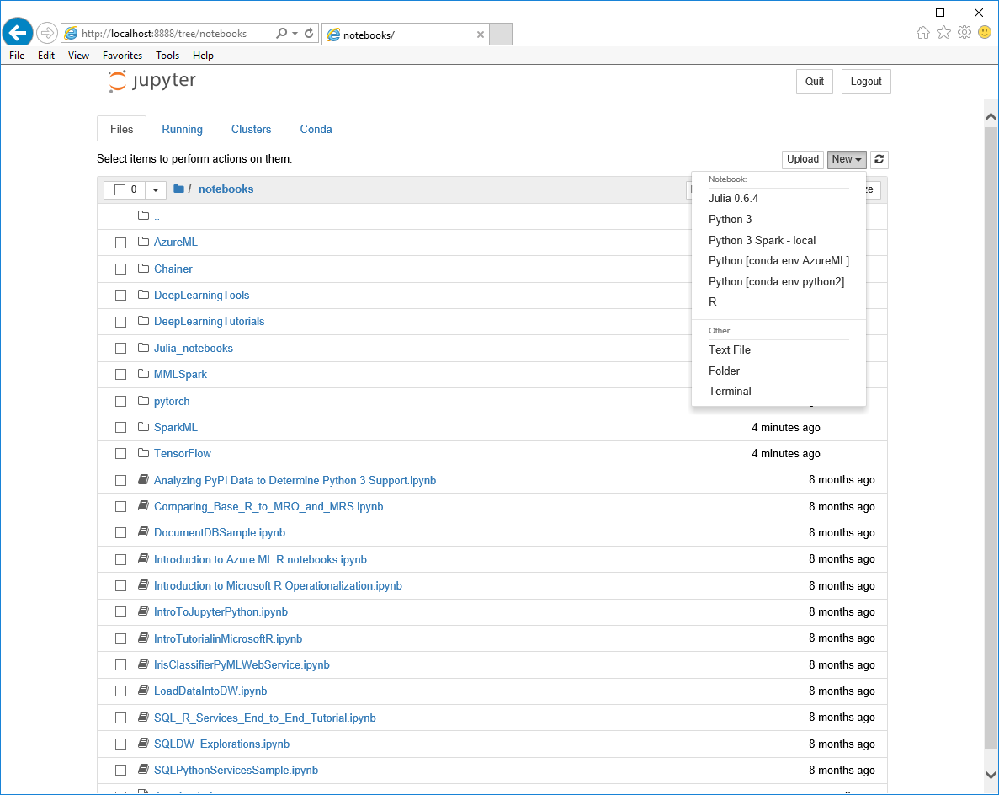
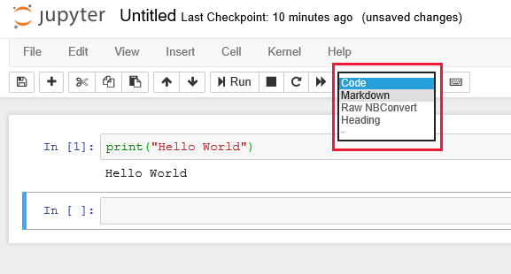
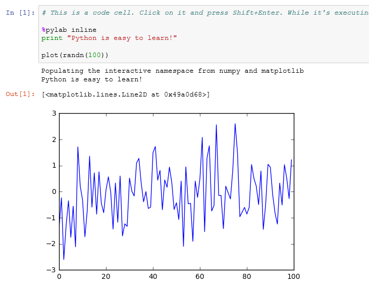

The Jupyter Notebook is a popular browser-based IDE for data science that is included in the DSVM. You can use Jupyter Notebooks to explore data and train models. The notebooks support both R and Python programming languages — specifically, Python 2, Python 3, Open Source R, and the Microsoft R Server. Although notebooks support rich annotations, they are programs that can execute entire data science pipelines.

## Why use Jupyter Notebooks?

### Create presentations with Jupyter Notebooks

The Jupyter Notebook integrates code, its output, and explanatory text all into a single document. Comparing to a traditional code editor, it's great for presentation because the file can contain items such as visualizations, tables, narrative texts, and equations.

### Collaborate with Jupyter Notebooks

You can export a Jupyter Notebook to different formats. By downloading it as an HTML file, you can share the results with a small group of people. Alternatively, you can save the notebook to its native format, with the **.ipynb** file extension, and then upload it to GitHub for a more direct sharing.

### Perform exploratory analysis with Jupyter Notebooks

The development process on Jupyter Notebook is extremely interactive. You write a small piece of code, observe the output immediately, and then write another piece of code. This is consistent with what data scientists do in their day-to-day work because data science is an iterative and exploratory process.

### Use multiple programming languages with Jupyter Notebooks

The Jupyter Notebook is a machine learning development environment for virtually any language. Jupyter Notebooks use a kernel-based architecture that separates the language interpreter from the notebook. Within the notebook you can use any language that has a Jupyter language kernel. All popular data science languages, including Python, R, Julia, and Java have kernels available.

## Create a simple Jupyter notebook.

1. To Use Jupyter Notebook, click the start menu tile, or the **Jupyter** icon on the desktop:

    

1. Under the **Files** tab, you can see the list of folders and files in the current directory. Select the location where you want to create your notebook.

1. In the right upper corner, click **New** to create a new notebook and select **Python 3** as the target language. Notice several language kernels are installed for you but you can install more if you like.

    

1. A new notebook is created, and an empty code cell waits for your input. You can run, add, remove, or edit the cells. The toolbar buttons allow you to complete various operations on selected cells such as: Delete, Copy, Move, and Run.

1. Type the following code into the cell and hit <kbd>Shift</kbd>+<kbd>Enter</kbd> at the end of the line to run the cell.

    ```python
    print("Hello World")
    ```
    > [!TIP]
    > Two commonly used keyboard shortcuts are <kbd>Ctrl</kbd>+<kbd>Enter</kbd> to run the selected cell, and <kbd>Shift</kbd>+<kbd>Enter</kbd>** to run the selected cell, move to the next cell when the selected cell is not the last one, and add a new cell.
    >
    > To open a full list of keyboard shortcuts, click on the keyboard icon in the toolbar.
    >  

1. You should see it echo "Hello World" below the cell. By default, cells execute in the *kernel*, which is a computational engine that executes the code contained in the cell.

1. Jupyter notebooks support other cell types - use the **Insert > Insert Cell Below** menu option to add a new cell to the notebook.

1. Select the new cell by clicking in the input area (it will have a colored line next to it when selected).

1. In the menu header, find the cell type - it's a drop down list which likely has "Code" selected currently. Select "Heading" from the list.

    

    > [!NOTE] 
    > Don't worry about the raw cell type; this cell type is used to format output when exporting the notebook using the NBConvert tool.

1. Heading cell types are just Markdown headers which are prefixed with `#` to create an H1/H2/H3/H4 heading. Type `### This is a heading` into the cell.

1. Add another cell by typing <kbd>Shift</kbd>+<kbd>Enter</kbd> and change the cell type to "Markdown".

1. Set the value to "\`This is Markdown\`" without the quotes - notice the backtick character - this denotes a "code" block and it will be formatted with a monospace font. You can use any Markdown syntax here to document or annotate your Python code.

    

1. Notice that the Python cell you entered first has an **In** prefix. Output from the **In** executed code displays in the cell immediately below, and is labeled **Out**.

1. Add a new code cell to the bottom and type in the following Python code.

    ```python
    %pylab inline
    print("Python is easy to learn!")
    
    plot(randn(100))
    ```

1. Execute the cell. Notice that it shows an **Out** cell with the cell number in brackets as shown in the following image.

    
